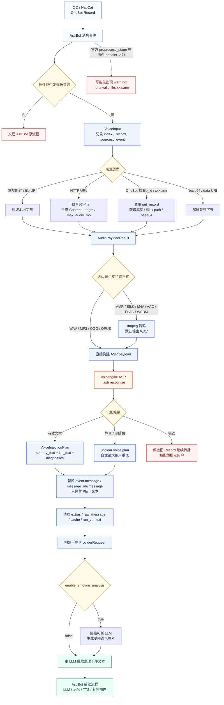
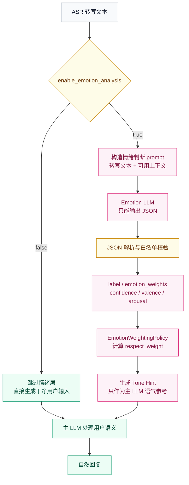

<!-- markdownlint-disable MD024 MD033 MD041 MD051 -->

<p align="center">
  
</p>

<h1 align="center">AstrBot 火山引擎语音转文字插件</h1>

<p align="center">
  <strong>把 QQ 语音变成 AstrBot 可以理解、记忆、推理并继续回复的用户输入。</strong>
</p>

<p align="center">
  
</p>

<p align="center">
  
  
  =4.16,<5">
  
  
  
</p>

<p align="center">
  <sub>小鞠在 README 门口值班。少、少啰嗦，她只是提醒后来维护的人：主线能力要讲清楚，bugfix 要收进修补史。</sub>
</p>

---

<div align="center">

| 快速导航 | 内容 |
| :--- | :--- |
| [项目定位](#positioning) | 这个插件为什么不是普通的“语音转文字回复器”。 |
| [核心能力](#core-capabilities) | ASR、转码、注入、清理、状态诊断与情绪判断。 |
| [快速开始](#quick-start) | Release zip、仓库安装、最小配置与状态检查。 |
| [语音工作流](#voice-workflow) | 从 OneBot Record 到干净 ProviderRequest 的完整链路。 |
| [2.0.0 情绪层](#emotion-layer) | 情绪判断 LLM、`respect_weight`、公式接口与边界。 |
| [Token 与延迟](#token-latency) | 测试服务器 1000 次参考值与风险说明。 |
| [配置指南](#configuration) | 常用配置、推荐值、调试开关与安全边界。 |
| [排障手册](#troubleshooting) | `not a valid file`、上传包结构、ffmpeg、ProviderRequest。 |
| [版本叙事](#version-story) | 以 2.0.0 为能力主线，2.1.x 折叠为兼容修补史。 |
| [维护与发布](#maintenance) | 打包、验证、发布包结构与维护原则。 |

</div>

---

<a id="positioning"></a>

## 项目定位

`astrbot_plugin_volcengine_asr` 是一个面向 AstrBot 的 QQ 语音输入适配插件。它监听 OneBot v11 / NapCat 传入的 `Record` 语音段，读取、下载或转码音频，然后调用火山引擎豆包语音“大模型录音文件极速版识别”接口，把语音转写成文本。

但它的目标不是“收到语音后机械回复一条转写结果”。它真正要做的是：

> 让 QQ 语音像普通文字消息一样进入 AstrBot 的 LLM、上下文、记忆、TTS 与后续插件流程。

这意味着插件必须同时处理四件事：

| 问题 | 为什么重要 |
| :--- | :--- |
| 语音转写 | 用户发来的是语音，LLM 需要文本语义。 |
| 输入注入 | 转写结果应成为用户输入，而不是停在插件直接回复。 |
| 媒体清理 | 原始 `Record(file="xxx.amr")` 如果继续流向 agent，可能触发 `not a valid file`。 |
| 语气辅助 | ASR 只给文字，容易丢失“用户正在怎么说”的细微信号。 |

所以，本插件更像一个“语音输入适配层”，不是一次性的 ASR 小工具。理想链路是：

```text
用户发送 QQ 语音
  -> 插件识别语音内容
  -> 插件把转写文本注入为干净用户输入
  -> AstrBot 像处理文字消息一样继续调用 LLM
  -> 记忆、上下文、TTS 和其它插件继续按原流程工作
```

一个典型 OneBot / NapCat 语音段看起来像这样：

```text
Record(file="32c1124cf292f19c30728a54db34992e.amr")
```

这个 `file` 很多时候不是 AstrBot 容器内真实存在的文件路径，而是 OneBot / NapCat 的语音资源标识。如果它被 AstrBot 官方预处理或后续 agent 当作本地文件读取，就可能出现：

```text
not a valid file: xxx.amr
```

因此，插件的主要价值不只是调用一次火山 ASR API，而是把语音安全地转换成后续组件能消费的文本输入，并尽量让旧媒体对象不要继续污染 LLM 请求、ProviderRequest、agent cache 或 run context。

<a id="core-capabilities"></a>

## 核心能力

| 能力 | 默认状态 | 说明 |
| :--- | :--- | :--- |
| QQ / OneBot / NapCat 语音识别 | 开启 | 识别 `Record` 组件和 OneBot dict 形态的 record 段。 |
| 火山引擎豆包语音 ASR | 开启 | 默认使用 `volc.bigasr.auc_turbo` 和 flash recognize API。 |
| Base64 上传 | 推荐 | 适合 Docker、NapCat、内网、临时 URL、`.amr/.silk` 场景。 |
| URL 直传 | 可选 | 仅当火山引擎可公网访问该 URL 时建议使用。 |
| 自动转码 | 开启 | 将 AMR、SILK、M4A、AAC、FLAC、WEBM 等转为 WAV / MP3 / OGG。 |
| 内置 ffmpeg | Release zip 可用 | Linux x86_64 / amd64 环境可直接使用包内 `ffmpeg`。 |
| 注入为用户输入 | 开启 | 转写结果默认进入后续 LLM，而不是只由插件回复。 |
| LivingMemory 友好 | 开启 | 记忆侧只保存干净转写文本，不保存语音提示词模板。 |
| ProviderRequest 清理 | 开启 | 原地净化 ProviderRequest-like 活对象，避免 dict 化破坏 AstrBot 内部调用。 |
| agent 前兜底清理 | 开启 | 在 `on_agent_begin` 再清一次 extras、cache、run_context 中残留的语音引用。 |
| 情绪判断 LLM | 默认关闭 | 2.0.0 引入，可选为主 LLM 提供受限语气参考。 |
| 情绪公式接口 | 可替换 | `EmotionWeightingPolicy` 让后续分支能换算法，而不破坏 ASR 主链路。 |
| 状态命令 | 开启 | `/volc_asr_status` 显示版本、鉴权、ffmpeg、提交模式和排障提示。 |

---

<a id="quick-start"></a>

## 快速开始

### 方式一：上传 Release zip

这是最推荐的安装方式，尤其适合 Docker、VPS、宝塔面板和不方便手动安装 `ffmpeg` 的环境。

1. 打开 [GitHub Releases](https://github.com/Ayleovelle/astrbot_plugin_volcengine_asr/releases/latest)。
2. 下载附件 `astrbot_plugin_volcengine_asr.zip`。
3. 进入 AstrBot WebUI 的插件页面。
4. 选择从文件安装。
5. 上传这个 zip。
6. 重载插件或重启 AstrBot。
7. 打开插件配置页，填写火山引擎鉴权信息。

重要提醒：

```text
请下载 Release 页面里的 astrbot_plugin_volcengine_asr.zip。
不要把 GitHub 绿色 Code 按钮下载的 Source code zip 当作安装包。
```

Release zip 固定为单顶层目录结构：

```text
astrbot_plugin_volcengine_asr/
├── metadata.yaml
├── main.py
├── _conf_schema.json
├── requirements.txt
├── README.md
├── CHANGELOG.md
├── assets/
├── bin/linux-x86_64/ffmpeg
└── third_party_licenses/
```

### 方式二：从仓库安装

在 AstrBot WebUI 中使用仓库地址：

```text
https://github.com/Ayleovelle/astrbot_plugin_volcengine_asr
```

如果 WebUI 需要 `.git` 后缀，也可以使用：

```text
https://github.com/Ayleovelle/astrbot_plugin_volcengine_asr.git
```

仓库安装会读取仓库根目录的 `metadata.yaml`、`main.py`、`_conf_schema.json` 和 `requirements.txt`。但仓库安装不等同于 Release zip 安装：仓库根目录不一定带 Release 包内置的 `bin/linux-x86_64/ffmpeg`，因此会依赖 `imageio-ffmpeg` 或系统 PATH 中的 `ffmpeg`。

### 最小配置

火山引擎侧需要先开通豆包语音识别能力。新版控制台通常只需要 `api_key`；旧版控制台可以使用 `app_key + access_key`。

推荐最小配置：

```text
api_key = 你的火山引擎 API Key
resource_id = volc.bigasr.auc_turbo
submit_mode = base64
enable_transcode = true
prefer_bundled_ffmpeg = true
inject_as_user_input = true
reply_transcription = false
enable_emotion_analysis = false
```

安装后在聊天中发送：

```text
/volc_asr_status
```

重点确认：

| 状态项 | 期望值 |
| :--- | :--- |
| 版本 | 当前上传版本，例如 `2.1.12-pr1` |
| 鉴权 | 已配置 |
| 提交方式 | Base64 上传 |
| 处理方式 | 注入为用户输入 |
| 自动转码 | 启用 |
| ffmpeg状态 | 可用 |
| 情绪判断 | 默认关闭 |

### 调试模式

如果只想确认 ASR 是否通，可以临时打开：

```text
reply_transcription = true
```

这样插件会直接回复转写结果，方便排查火山鉴权、音频读取和 ffmpeg。确认主链路可用后，建议改回：

```text
reply_transcription = false
inject_as_user_input = true
```

---

<a id="voice-workflow"></a>

## 语音工作流

下面是当前主链路。它不是单纯“收到 Record -> 调 API -> 回文字”，而是多阶段地把语音变成可被 AstrBot 后续流程安全消费的输入。



### 五个核心对象

| 对象 | 作用 |
| :--- | :--- |
| `VoiceInput` | 记录一条语音的来源、序号和事件上下文。 |
| `AudioPayloadResult` | 统一描述读取、下载、get_record、base64、转码后的音频负载。 |
| `AsrResult` | 承载火山返回的转写文本、request_id、logid、耗时。 |
| `VoiceInjectionPlan` | 决定写入记忆的干净文本、进入 LLM 的文本、诊断信息和 unclear 状态。 |
| `ProviderRequest` | AstrBot 后续 LLM 请求对象，插件尽量原地净化，不把它替换成普通 dict。 |

### 为什么要多次清理

真实部署里，旧语音对象可能藏在很多地方：

```text
event.message
event.message_chain
event.raw_message
event.extras
event.message_obj.extras
provider_request.messages
provider_request.extra_user_content_parts
run_context.stage_data
run_context.cache
其它插件写入的临时上下文
```

插件会在消息处理成功后清理一次，并在 `on_agent_begin` 再兜底清理一次。这样做的目标是减少后续 `agent_sub_stages` 再次扫到旧 `Record(file="xxx.amr")` 的概率。

---

<a id="emotion-layer"></a>

## 2.0.0 情绪层

`v2.0.0` 是这个插件的核心能力版本。它引入的不是心理诊断，也不是让另一个模型替用户下结论，而是一个可选的、结构化的、受权重约束的“语气参考层”。

默认关闭：

```text
enable_emotion_analysis = false
```

开启后，每条成功识别的语音会额外调用一次 LLM。该 LLM 只负责输出结构化 JSON，主 LLM 只按 `respect_weight` 有限参考它，不把它当作事实。

### 工作流



### 情绪算法并非凭空捏造

这里是本文档最贴近论文的部分。我个人在审核的过程中直接看理解了，这部分选择不看、跳过，不影响插件的安装和使用。

插件的情绪算法不是凭空捏造。它把三个相对稳定的思想工程化地组合起来：

| 思想 | 在插件中的体现 |
| :--- | :--- |
| 离散情绪标签 | `neutral, happy, sad, angry, anxious, frustrated, excited, confused, tired`。 |
| 维度情绪描述 | `valence` 表示正负效价，`arousal` 表示唤醒度。 |
| 分布确定性 | `emotion_weights` 越集中，熵越低，判断越确定。 |
| 证据约束 | `voice_text_support` 与 `context_support` 越低，权重越受抑制。 |
| 上限控制 | `emotion_max_respect_weight_percent` 限制情绪判断最多影响主 LLM 到什么程度。 |

离散标签方便 LLM 写提示词；`valence/arousal` 让结果不只停留在标签名；熵和证据项用于防止“模型说得很像真的”就获得过高影响力。

### JSON 输出

情绪判断 LLM 的目标输出：

```json
{
  "label": "anxious",
  "emotion_weights": {
    "anxious": 0.72,
    "neutral": 0.28
  },
  "confidence": 0.68,
  "valence": -0.35,
  "arousal": 0.62,
  "voice_text_support": 0.80,
  "context_support": 0.30,
  "reason": "语气显得担心"
}
```

字段约束：

| 字段 | 含义 | 处理方式 |
| :--- | :--- | :--- |
| `label` | 主情绪标签 | 不在白名单时回退到权重最高标签或 `neutral`。 |
| `emotion_weights` | 多标签概率近似 | 移除非法标签，归一化到总和接近 1。 |
| `confidence` | 模型对判断的置信度 | clamp 到 `[0, 1]`。 |
| `valence` | 情绪效价 | clamp 到 `[-1, 1]`。 |
| `arousal` | 唤醒度 | clamp 到 `[0, 1]`。 |
| `voice_text_support` | 转写文本证据强度 | clamp 到 `[0, 1]`。 |
| `context_support` | 上下文证据强度 | clamp 到 `[0, 1]`。 |
| `reason` | 简短依据 | 截断，避免复述用户原文或生成长推理。 |

### respect_weight 公式

令：

- \(t\)：转写文本字符数。
- \(c\)：情绪 LLM 输出的 `confidence`。
- \(p_i\)：归一化后的第 \(i\) 个情绪权重。
- \(n\)：有效情绪标签数。
- \(s_v\)：`voice_text_support`。
- \(s_c\)：`context_support`。
- \(r_{\max}\)：`emotion_max_respect_weight_percent / 100`。

情绪分布的 Shannon 熵为：

$$
H(p) = -\sum_{i=1}^{n} p_i \log p_i
$$

归一化确定性为：

$$
C(p) =
\begin{cases}
1, & n \le 1 \\
1 - \frac{H(p)}{\log n}, & n > 1
\end{cases}
$$

文本长度因子为：

$$
L(t) = \min\left(1, \frac{\log(1 + \max(0, t))}{\log 81}\right)
$$

证据强度为：

$$
E = L(t) \cdot (0.7s_v + 0.3s_c)
$$

经过置信度与证据门控后的确定性为：

$$
C'(p) = C(p) \cdot \max(c, E)
$$

最终参考权重为：

$$
r = r_{\max} \cdot (0.5c + 0.3C'(p) + 0.2E)
$$

短文本保护规则：

$$
r =
\begin{cases}
\min(r, 0.25), & t < 12 \\
r, & t \ge 12
\end{cases}
$$

最终输出：

$$
\operatorname{respect\_weight}
= \operatorname{round}(\operatorname{clip}(r, 0, r_{\max}), 3)
$$

纯文本 fallback：

```text
certainty = 1 - entropy(weights) / log(label_count)
length_factor = min(1, log(1 + transcript_chars) / log(81))
evidence = length_factor * (0.7 * voice_text_support + 0.3 * context_support)
certainty = certainty * max(confidence, evidence)
respect_weight = max_respect_weight * (0.5 * confidence + 0.3 * certainty + 0.2 * evidence)
if transcript_chars < 12:
    respect_weight = min(respect_weight, 0.25)
respect_weight = round(clamp(respect_weight, 0, max_respect_weight), 3)
```

### 为什么这样设计

| 设计点 | 理由 |
| :--- | :--- |
| `confidence` 占 0.5 | 模型自己对判断不确定时，不应强烈影响主 LLM。 |
| `certainty` 占 0.3 | 情绪分布越分散，说明标签之间竞争越强，应降低影响。 |
| `evidence` 占 0.2 | 文本与上下文证据不足时，即使模型给了标签，也应保守。 |
| 短文本上限 0.25 | “嗯”“算了”“没事”这类短语很容易误判，必须限幅。 |
| `r_max` 上限 | 情绪层只能给语气建议，不能覆盖用户明确请求。 |

这套公式的目标不是“算准用户真实情绪”，而是控制主 LLM 的参考强度：证据充分、分布集中、置信度高时多参考；证据弱、文本短、分布散时少参考。

### 情绪公式接口

从 `v2.1.8` 开始，情绪权重公式被抽成接口：

```python
class EmotionWeightingPolicy(Protocol):
    def compute_respect_weight(self, data: EmotionWeightingInput) -> float:
        ...
```

默认实现是 `DefaultEmotionWeightingPolicy`。后续分支如果要改公式，只需要提供新的 policy：

```python
class MyEmotionWeightingPolicy:
    def compute_respect_weight(self, data: EmotionWeightingInput) -> float:
        return 0.0

plugin.emotion_weighting_policy = MyEmotionWeightingPolicy()
```

这样可以避免把实验公式直接写进主 ASR 流程，降低后续维护风险。

---

<a id="token-latency"></a>

## Token 与延迟风险

情绪判断默认关闭，因为它会额外调用一次 LLM。下面是测试服务器上的 1000 次参考值。

<details open>
<summary>展开：测试服务器 1000 次参考值（deepseek-v4-flash，无上下文）</summary>

测试口径：本测试使用测试服务器中已配置的 `deepseek/deepseek-v4-flash`，不提供历史上下文，不加载其它插件。为排除聊天主链路影响，没有走 AstrBot 聊天消息链，而是直接调用同一模型的情绪判断 prompt。因此它衡量的是 `enable_emotion_analysis=true` 后额外增加的那一次情绪 LLM 调用，不包含 ASR、主 LLM 正常回复、TTS 或其它插件耗时。

固定测试输入：

| 项目 | 值 |
| :--- | :--- |
| 测试模型 | `deepseek-v4-flash` |
| 测试次数 | 关闭时额外调用为 0；开启组 1000 次有效样本 |
| 测试并发 | 5，用于完成采样；每条延迟按单次请求自身耗时记录 |
| 语音转写文本长度 | 20 个中文字符 |
| 上下文 | 无历史上下文；`emotion_context_turns = 0` |
| 上下文占位 | `（无可用上下文）` |
| 情绪判断 prompt 长度 | 642 个字符 |
| HTTP 成功率 | 1000 / 1000 |
| JSON 成功率 | 993 / 1000 |

增量结果：

| 配置 | 额外情绪 LLM 调用 | 平均 prompt tokens 增量 | 平均 completion tokens 增量 | 平均 total tokens 增量 | 平均额外延迟 |
| :--- | :---: | ---: | ---: | ---: | ---: |
| `enable_emotion_analysis=false` | 0 次 | 0 | 0 | 0 | 0 ms |
| `enable_emotion_analysis=true` | 1 次 / 条语音 | 273.0 | 247.5 | 520.5 | 6085.2 ms |

分布：

| 指标 | 最小值 | 最大值 | 平均值 | 中位数 | P90 | P95 | P99 | 标准差 |
| :--- | ---: | ---: | ---: | ---: | ---: | ---: | ---: | ---: |
| 延迟 ms | 4563.7 | 11272.6 | 6085.2 | 5905.4 | 7135.2 | 7789.0 | 9132.6 | 858.3 |
| prompt tokens | 273.0 | 273.0 | 273.0 | 273.0 | 273.0 | 273.0 | 273.0 | 0.0 |
| completion tokens | 141.0 | 744.0 | 247.5 | 233.0 | 318.0 | 364.1 | 450.1 | 63.0 |
| total tokens | 414.0 | 1017.0 | 520.5 | 506.0 | 591.0 | 637.1 | 723.1 | 63.0 |

风险分析：

| 风险 | 本次测试观察 | 对实际使用的含义 |
| :--- | :--- | :--- |
| 固定 prompt 成本 | prompt tokens 固定为 273。 | 无上下文时，每条语音至少多一段情绪判断提示词成本。 |
| 输出长度波动 | completion tokens 从 141 到 744，P99 为 450.1。 | 模型生成 JSON 的字段值和 `reason` 长度会波动，偶发长输出会抬高 token 成本。 |
| 尾部延迟 | 平均 6.09 秒，P95 为 7.79 秒，P99 为 9.13 秒，最大 11.27 秒。 | 开启后用户体感不只受平均值影响，高峰排队、网络往返或长输出会让少量请求明显变慢。 |
| JSON 格式失败 | 1000 次中 993 次可解析为 JSON。 | 情绪判断偶发格式失败是正常风险；默认 `emotion_fail_open = true` 会跳过情绪增强，避免中断 ASR 主链路。 |
| 上下文成本 | 本次为 0 轮上下文。 | 如果提高 `emotion_context_turns`，prompt tokens 会随上下文长度增加。 |

免责声明：本测试只用于估算开启 `enable_emotion_analysis=true` 后额外情绪判断 LLM 调用带来的 token 与延迟增量。测试中涉及的 LLM 调用均使用 `deepseek-v4-flash`，无历史上下文，不加载其它插件，且未覆盖真实聊天链路中的 ASR、主 LLM 回复、TTS、网络波动、插件联动和 AstrBot 队列状态。因此，本结果只能作为当前测试环境下的参考值，不能视为所有部署环境的性能承诺或成本保证。

解释：prompt tokens 在固定输入下保持稳定，因为情绪判断模板、上下文占位和转写文本长度固定；completion tokens 波动较大，是因为模型生成 JSON 时字段值和理由长度并不完全相同；延迟波动来自模型服务端排队、网络往返和输出长度差异。实际部署中，语音文本更长、上下文轮数更多，prompt tokens 会随之上升；如果缩短 `emotion_prompt_template` 或降低 `emotion_context_turns`，额外成本会下降。

</details>

---

<a id="configuration"></a>

## 配置指南

### 识别与鉴权

| 配置项 | 类型 | 默认值 | 建议 |
| :--- | :--- | :--- | :--- |
| `api_key` | string | 空 | 新版控制台优先填写。 |
| `app_key` | string | 空 | 旧版控制台使用。 |
| `access_key` | string | 空 | 旧版控制台使用。 |
| `resource_id` | string | `volc.bigasr.auc_turbo` | 保持默认，除非火山控制台给出不同资源。 |
| `endpoint` | string | flash recognize API | 一般不需要改。 |
| `uid` | string | 空 | 留空时自动生成。 |
| `timeout_seconds` | int | `60` | 网络较慢时可适当提高。 |

### 音频读取与转码

| 配置项 | 类型 | 默认值 | 建议 |
| :--- | :--- | :--- | :--- |
| `submit_mode` | string | `base64` | Docker / NapCat 推荐保持 `base64`。 |
| `max_audio_mb` | int | `20` | 火山接口上限更高，但 QQ 语音通常不需要调大。 |
| `enable_transcode` | bool | `true` | 建议开启。 |
| `prefer_bundled_ffmpeg` | bool | `true` | Release zip + Linux x86_64 推荐开启。 |
| `ffmpeg_path` | string | `auto` | 特殊环境可填 `/usr/bin/ffmpeg`。 |
| `transcode_output_format` | string | `wav` | 兼容性优先用 `wav`。 |
| `transcode_sample_rate` | int | `16000` | QQ 短语音够用。 |
| `transcode_channels` | int | `1` | 单声道更稳定。 |

### AstrBot 行为

| 配置项 | 类型 | 默认值 | 建议 |
| :--- | :--- | :--- | :--- |
| `auto_recognize` | bool | `true` | 自动识别语音。 |
| `enable_private` | bool | `true` | 私聊启用。 |
| `enable_group` | bool | `true` | 群聊启用。 |
| `only_when_at_or_wake` | bool | `false` | 群聊较吵时可打开。 |
| `ignore_self` | bool | `true` | 避免机器人自己的语音触发循环。 |
| `inject_as_user_input` | bool | `true` | 推荐保持开启。 |
| `reply_transcription` | bool | `false` | 只在调试时打开。 |
| `stop_event_after_recognition` | bool | `true` | 直接回复模式下阻止旧 Record 继续传播。 |
| `send_empty_result_message` | bool | `true` | 静音或空结果时提示。 |

### 情绪判断

| 配置项 | 类型 | 默认值 | 建议 |
| :--- | :--- | :--- | :--- |
| `enable_emotion_analysis` | bool | `false` | 默认关闭，确认可接受 token 与延迟后再开。 |
| `emotion_model_id` | string | 空 | 留空使用当前会话主 LLM。 |
| `emotion_context_turns` | int | `4` | 成本敏感时设为 `0` 或 `1`。 |
| `emotion_max_respect_weight_percent` | int | `60` | 建议 30-70；越高越影响主 LLM 语气。 |
| `emotion_timeout_seconds` | int | `20` | 网络波动大时可调高。 |
| `emotion_fail_open` | bool | `true` | 推荐开启，避免情绪层失败中断主链路。 |
| `emotion_prompt_template` | string | 内置 JSON 模板 | 高级配置，必须保留 `{text}` 和 `{context}`。 |

### 提示与排障

| 配置项 | 类型 | 默认值 | 建议 |
| :--- | :--- | :--- | :--- |
| `notify_config_error` | bool | `true` | 鉴权未配时在聊天中提示。 |
| `notify_asr_error` | bool | `true` | ASR 失败时提示。 |
| `show_logid` | bool | `false` | 排查火山问题时临时打开。 |
| `reply_template` | string | `语音转文字：{text}` | 仅直接回复模式使用。 |
| `voice_prompt_template` | string | 内置模板 | 注入主 LLM 的语音语境提示。 |
| `inject_on_unclear_voice` | bool | `true` | 没听清时让主 LLM 自然请求用户重说。 |
| `unclear_voice_prompt` | string | 内置模板 | 没听清时的注入提示。 |

---

<a id="troubleshooting"></a>

## 排障手册

### 上传 zip 后提示 `Not a directory: CHANGELOG.md`

原因通常是安装了错误的平铺 zip，或自己重新压缩时把文件直接放在 zip 顶层。

正确结构：

```text
astrbot_plugin_volcengine_asr/
├── CHANGELOG.md
├── main.py
└── metadata.yaml
```

错误结构：

```text
CHANGELOG.md
main.py
metadata.yaml
```

处理方式：

1. 删除 AstrBot 插件页中的失败项 `plugin_upload_*`。
2. 下载 Release 附件 `astrbot_plugin_volcengine_asr.zip`。
3. 不要重新压缩，不要上传 GitHub Source code zip。
4. 重新从文件安装。

如果 AstrBot 提示“目录已存在”，先在 WebUI 中卸载旧插件，保留配置和数据，再上传新 zip。

### 上传 zip 后找不到 `metadata.yaml`

请确认上传的是 Release 页面里的 `astrbot_plugin_volcengine_asr.zip`，不是 GitHub 绿色 Code 按钮生成的 Source code zip。

Source code zip 外层目录通常类似：

```text
astrbot_plugin_volcengine_asr-main/
```

它可能不包含内置 `ffmpeg`，也可能与 AstrBot 上传安装器预期结构不一致。

### `preprocess_stage` 提示 `Voice processing failed`

如果日志出现：

```text
[preprocess_stage.stage:81]: Voice processing failed: not a valid file: xxx.amr
```

注意：这通常发生在插件 handler 之前，属于 AstrBot 官方预处理阶段，不一定代表本插件失败。

判断方式：

| 日志位置 | 含义 |
| :--- | :--- |
| `preprocess_stage.stage:81` | 官方预处理在插件前读不到语音文件。 |
| `agent_sub_stages.internal:402` | 后续 agent 仍扫到旧 `Record`，需要确认插件清理是否生效。 |
| 插件日志出现 `ffmpeg` 失败 | 插件转码链路有问题。 |
| 插件日志出现火山 `logid` | 请求已到火山，可用 logid 排查。 |

Docker / NapCat 场景中，常见原因是 NapCat 返回的 `.amr` 文件标识不在 AstrBot 容器内，或两个容器没有共享同一个数据卷。

建议过滤日志：

```bash
docker logs --tail=500 astrbot 2>&1 | grep -E 'preprocess_stage|agent_sub_stages|get_record|ffmpeg|not a valid file|语音识别'
```

### `agent_sub_stages` 仍报 `not a valid file: xxx.amr`

先确认：

1. 插件版本至少为 `2.1.12-pr1`。
2. 安装的是 Release 附件，不是旧 zip。
3. 已重启 AstrBot。
4. `/volc_asr_status` 显示版本正确。

如果仍出现，说明旧 `Record` 可能藏在未覆盖的上下文或其它插件缓存中。请提供：

```text
/volc_asr_status
```

以及上面的过滤日志。插件已经覆盖常见的 `event.extras`、`message_obj.extras`、`provider_request`、`run_context`、`messages`、`stage_data`、`raw_message` 等形态，但真实部署里仍可能有其它插件写入自定义缓存。

### 报 `'dict' object has no attribute 'model_dump_for_context'`

这是旧版本在净化 `ProviderRequest` 时可能把活对象替换成普通 dict 导致的。当前版本会原地净化 ProviderRequest-like 对象；如果缓存别名本身就是 dict 且含音频引用，会尽量替换成干净的 ProviderRequest。

处理方式：

1. 升级到当前 Release zip。
2. 重启 AstrBot。
3. 再发 `/volc_asr_status` 确认版本。

### 提示需要 `ffmpeg`

按顺序检查：

1. 是否使用 Release zip。
2. 服务器是否为 Linux x86_64 / amd64。
3. `prefer_bundled_ffmpeg` 是否为 `true`。
4. `ffmpeg_path` 是否为 `auto` 或正确绝对路径。
5. `/volc_asr_status` 中 `ffmpeg状态` 是否可用。

非 Linux x86_64 / amd64 环境建议：

```text
prefer_bundled_ffmpeg = false
ffmpeg_path = /usr/bin/ffmpeg
```

路径按实际系统修改。

### Bot 只回复转写文本，不继续对话

检查：

```text
inject_as_user_input = true
reply_transcription = false
```

如果 `reply_transcription=true`，插件会进入调试或旧行为：直接回复转写结果，而不是注入为用户输入。

### 想让 Bot 收到语音后尽量语音回复

本插件负责“语音输入”。语音输出需要 TTS 插件或 AstrBot 的 TTS 能力。

推荐链路：

```text
本插件：QQ 语音 -> 干净用户文本
主 LLM：理解并回复
TTS 插件：主 LLM 回复 -> 语音
```

默认 `voice_prompt_template` 可以引导主 LLM 倾向语音风格回复，但实际能否语音输出取决于你是否配置了 TTS。

### SHA256 是什么

SHA256 是文件校验码，用于确认下载包没有损坏或被替换。

Windows PowerShell 校验：

```powershell
Get-FileHash .\astrbot_plugin_volcengine_asr.zip -Algorithm SHA256
```

---

<a id="version-story"></a>

## 版本叙事

这份 README 的主叙事以 `v2.0.0` 为中心。原因很简单：`v2.0.0` 定义了本插件和普通 ASR 插件之间最关键的差异，也就是“语音输入不只有转写内容，还可以有受控语气参考层”。

| 版本段 | 定位 | README 中的处理方式 |
| :--- | :--- | :--- |
| `v1.x` | 基础语音识别与早期注入 | 作为历史背景。 |
| `v2.0.0` | 情绪判断 LLM 与 `respect_weight` | 作为核心能力详细介绍。 |
| `v2.1.0` | 五段式语音工作流重建 | 作为可靠性架构说明。 |
| `v2.1.x` | 真实部署中的 bugfix 与兼容加固 | 收进折叠修补史，不抢主叙事。 |

后续版本确实会继续修 bug、补边界、加诊断。可 README 首页不能被 bug 日志淹没。主页应先说明这个插件为什么值得用，`CHANGELOG.md` 再负责记录一路修了什么。

关键版本：

| 版本 | 说明 |
| :--- | :--- |
| `v2.0.0` | 引入情绪判断 LLM、结构化 JSON 和 `respect_weight`。 |
| `v2.1.0` | 重建五段式语音工作流：`VoiceInput -> AudioPayloadResult -> ASR -> VoiceInjectionPlan -> ProviderRequest`。 |
| `v2.1.8` | 抽出 `EmotionWeightingPolicy`，方便后续分支安全替换情绪公式。 |
| `v2.1.11` | 修复 ProviderRequest 活对象被 dict 化导致的 `model_dump_for_context` 问题。 |
| `v2.1.12` | 固定 Release zip 为单顶层目录，兼容 AstrBot 上传安装器。 |

<details>
<summary>展开：按顺序查看 2.1.x 修补史</summary>

| 版本 | 类型 | 主要意义 |
| :--- | :--- | :--- |
| `v2.1.0` | 架构重建 | 将语音主链路固定为 `VoiceInput -> AudioPayloadResult -> ASR -> VoiceInjectionPlan -> ProviderRequest`。 |
| `v2.1.1` | 失败路径清理 | 清理情绪判断与直接回复路径的语音残留，避免失败后旧 `Record` 继续进入 agent。 |
| `v2.1.2` | agent 媒体扫描绕过 | 提前写入干净 `provider_request`，绕过内置 agent 对旧 `.amr` 的媒体扫描。 |
| `v2.1.3` | 发布通道修复 | 重新发布 Release，规避 GitHub immutable release 占用并修复发布说明编码。 |
| `v2.1.4` | AstrBot 更新器兼容 | 补充仓库 URL，并收紧与官方 agent 的交接方式。 |
| `v2.1.5` | Docker / NapCat 排障 | 增强 `/volc_asr_status` 与 README 排障说明，明确 `preprocess_stage` 边界。 |
| `v2.1.7` | Record 发现加固 | 扫描 `event.extras`、`message_obj.extras` 等异形缓存中的嵌套 record。 |
| `v2.1.8` | agent 缓存与情绪接口 | 新增 `on_agent_begin` 兜底清理，并抽出 `EmotionWeightingPolicy`。 |
| `v2.1.9` | 未知缓存与 run_context | 加固 agent 前未知缓存和 `run_context` 清理。 |
| `v2.1.10` | Release 重发 | 重发 `v2.1.9` 修复，确保正式 Release 页面携带 zip 附件。 |
| `v2.1.11` | ProviderRequest 活对象保护 | 原地净化 ProviderRequest-like 对象，避免变成普通 dict。 |
| `v2.1.12` | 上传包目录结构 | Release zip 固定为 `astrbot_plugin_volcengine_asr/` 单顶层目录，兼容 AstrBot 上传安装器。 |

这些修补都很重要。它们解决了 Docker / NapCat 路径隔离、AstrBot 官方 `preprocess_stage` 与插件 handler 的先后关系、`agent_sub_stages` 中旧 `Record` 残留、ProviderRequest 活对象保护、extras / run_context 深层清理、Release zip 结构等真实部署问题。

但这些问题本质上是“让核心能力在真实环境里跑稳”。它们不应该覆盖项目主叙事。

</details>

完整历史见 [CHANGELOG.md](./CHANGELOG.md)。

---

<a id="maintenance"></a>

## 维护与发布

### 目录结构

仓库结构：

```text
.
├── assets/
├── main.py
├── metadata.yaml
├── _conf_schema.json
├── requirements.txt
├── CHANGELOG.md
├── README.md
├── scripts/
├── tests/
└── astrbot_plugin_volcengine_asr/
    ├── assets/
    ├── bin/linux-x86_64/ffmpeg
    ├── main.py
    ├── metadata.yaml
    ├── _conf_schema.json
    ├── requirements.txt
    ├── CHANGELOG.md
    └── README.md
```

说明：

| 路径 | 用途 |
| :--- | :--- |
| 仓库根目录 | 支持 AstrBot 从 GitHub 仓库地址安装。 |
| 根目录 `main.py` | 轻量入口，完整实现位于包目录。 |
| `astrbot_plugin_volcengine_asr/` | Release zip 的内容来源。 |
| `bin/linux-x86_64/ffmpeg` | Release zip 内置 ffmpeg。 |
| `scripts/build_release_zip.py` | 构建并校验 Release zip。 |

Release zip 顶层固定只有：

```text
astrbot_plugin_volcengine_asr/
```

### 发布前检查

建议至少执行：

```powershell
python -m py_compile astrbot_plugin_volcengine_asr/main.py tests/test_voice_workflow.py tests/test_helpers.py
```

```powershell
python scripts/run_local_iteration_tests.py 1 output/local_iteration_release_check.csv
```

```powershell
python scripts/build_release_zip.py
Get-FileHash output/astrbot_plugin_volcengine_asr.zip -Algorithm SHA256
```

当前本地验证记录：

| 项目 | 结果 |
| :--- | :--- |
| 本地迭代回归 | 93 项通过 |
| 测试服安装 | 成功 |
| 失败插件列表 | 空 |
| `/volc_asr_status` | 返回 `2.1.12-pr1`，内置 ffmpeg 可用 |

### Web UI 接口预留

当前插件不内置完整 Web UI，但已经预留稳定后端接口。未来配置页、状态页和情绪计算可视化应优先调用这些方法，而不是直接读取插件内部属性。

| 接口 | 用途 |
| :--- | :--- |
| `get_webui_state()` | 返回运行状态快照，包括鉴权、接口、提交模式、转码、情绪判断和 LivingMemory 兼容状态。 |
| `get_webui_config_schema()` | 返回 `_conf_schema.json`，供 Web UI 渲染配置表单。 |
| `get_webui_config_snapshot()` | 返回当前配置值，并对密钥做掩码。 |
| `update_webui_config(updates)` | 给 Web UI 保存配置，包含字段白名单、类型转换、范围校验和运行时重载。 |

### 维护原则

- 默认优先保护主语音链路，不为了小范围适配破坏 ASR、转码、注入和 ProviderRequest 清理边界。
- 遇到真实环境 bug，优先补诊断和回归测试，再补兼容逻辑。
- 不默认 monkey patch AstrBot 私有 pipeline，除非明确引入实验开关并说明风险。
- 情绪判断、Web UI、TTS 联动都应作为可替换层，不要绑死在语音识别主流程里。
- README 主叙事以 `v2.0.0` 的能力为中心；后续 bugfix 进入修补史和 `CHANGELOG.md`。

<details>
<summary>展开：开发者趣味质量徽章</summary>

<p align="center">
  
</p>

这个图只作为维护者内部的趣味提示，不参与插件功能、审核结论或用户安装判断。上传展示时真正重要的是：包结构正确、配置清楚、主链路测试通过、排障信息可复现。

</details>

---

## 参考资料

- [AstrBot Plugin Development Guide](https://docs.astrbot.app/en/dev/star/plugin-new.html)：插件 metadata、支持平台和 AstrBot 版本声明。
- [火山引擎：大模型录音文件极速版识别 API](https://www.volcengine.com/docs/6561/1631584)：flash recognize 接口、`volc.bigasr.auc_turbo`、音频格式与大小限制。
- [OneBot v11 消息段类型](https://283375.github.io/onebot_v11_vitepress/message/segment.html)：消息段、文件引用和媒体字段规范。
- [NapCatQQ API 接口文档](https://www.napcat.wiki/onebot/api)：`get_record` 获取语音资源的接口说明。
- Russell, J. A. (1980). [A Circumplex Model of Affect](https://cir.nii.ac.jp/crid/1364233270668322432?lang=en). `DOI: 10.1037/h0077714`。
- Shannon, C. E. (1948). [A Mathematical Theory of Communication](https://people.math.harvard.edu/~ctm/home/text/others/shannon/entropy/entropy.pdf).
- [ffmpeg](https://ffmpeg.org/) 与 [imageio-ffmpeg](https://github.com/imageio/imageio-ffmpeg)：Release zip 内置 ffmpeg 的来源与许可参见 `third_party_licenses/imageio-ffmpeg.LICENSE`。

---

## 吉祥物

<details>
<summary>展开欣赏：小鞠 Codex 宠物图集</summary>

<p align="center">
  
</p>

小鞠不参与 ASR、转码、ProviderRequest 清理或情绪权重计算。她只负责在文档里提醒维护者：上传前检查目录结构，发布前跑测试，遇到 bug 先看日志。少、少啰嗦，这样以后才不会更麻烦。

</details>
