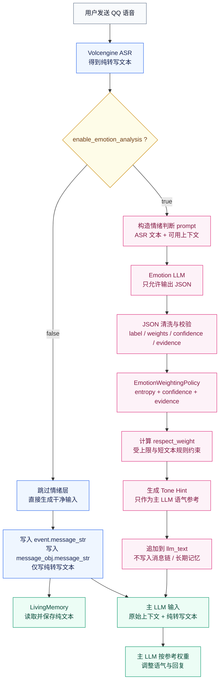

<!-- markdownlint-disable MD024 MD033 MD041 MD051 -->

<p align="center">
  
</p>

<p align="center">
  
</p>

<h1 align="center">AstrBot 火山引擎语音转文字插件</h1>

<p align="center">
  <strong>把 QQ 语音变成 AstrBot 可以理解、记忆、推理和继续回复的用户输入。</strong>
</p>

<p align="center">
  
  
  =4.16,<5">
  
  
</p>

<p align="center">
  
  
  
  
</p>

---

## 快速导航

<table align="center">
  <thead>
    <tr>
      <th align="left">主题</th>
      <th align="left">内容</th>
    </tr>
  </thead>
  <tbody>
    <tr>
      <td><a href="#项目定位">项目定位</a></td>
      <td>为什么它不是普通的“语音转文字回复器”。</td>
    </tr>
    <tr>
      <td><a href="#200-核心能力情绪判断-llm">2.0.0 核心能力</a></td>
      <td>情绪判断 LLM、语气参考层、<code>respect_weight</code> 公式。</td>
    </tr>
    <tr>
      <td><a href="#情绪权重计算与论证">详细论证</a></td>
      <td>像论文一样展开公式、边界、假设和失效条件。</td>
    </tr>
    <tr>
      <td><a href="#快速开始">快速开始</a></td>
      <td>Release zip 安装、仓库安装、最小配置。</td>
    </tr>
    <tr>
      <td><a href="#语音工作流">语音工作流</a></td>
      <td><code>VoiceInput</code> -> <code>AudioPayloadResult</code> -> <code>ASR</code> -> <code>VoiceInjectionPlan</code> -> <code>ProviderRequest</code>。</td>
    </tr>
    <tr>
      <td><a href="#兼容设计">兼容设计</a></td>
      <td>AstrBot / OneBot / NapCat / Docker / ffmpeg 的边界。</td>
    </tr>
    <tr>
      <td><a href="#配置指南">配置指南</a></td>
      <td>推荐配置、完整配置项、提示词模板。</td>
    </tr>
    <tr>
      <td><a href="#常见问题与排障">排障</a></td>
      <td><code>not a valid file</code>、上传包结构、ffmpeg、ProviderRequest。</td>
    </tr>
    <tr>
      <td><a href="#版本叙事">版本叙事</a></td>
      <td>2.0.0 是能力主线，2.1.x 主要是兼容修补史。</td>
    </tr>
    <tr>
      <td><a href="#项目吉祥物小鞠">项目吉祥物</a></td>
      <td>小鞠展示图与完整 Codex 宠物图集。</td>
    </tr>
  </tbody>
</table>

---

## 项目吉祥物：小鞠

<p align="center">
  
</p>

<p align="center">
  <strong>小鞠正在 README 门口值班。</strong><br>
  <sub>少、少啰嗦，她只是来监督核心能力别被 bugfix 淹没。</sub>
</p>

小鞠是这个项目的 Codex 宠物吉祥物。她的工作不参与 ASR、转码、ProviderRequest 清理或情绪权重计算，只负责在文档里安静地提醒维护者：核心能力要讲清楚，后续 bugfix 要收进修补史里。

<details>
<summary>展开欣赏：完整小鞠 Codex 宠物图集</summary>

<p align="center">
  
</p>

宠物源文件已整理进仓库 `assets/` 目录。README 开篇展示使用轻量挥手 GIF；完整 spritesheet 保留在折叠区，保证 GitHub、Release 包和 AstrBot 插件目录中都能正常显示。

</details>

---

## 项目定位

`astrbot_plugin_volcengine_asr` 是一个面向 AstrBot 的 QQ 语音输入插件。它监听 OneBot v11 / NapCat 传入的 `Record` 语音段，读取、下载或转码音频，然后调用火山引擎豆包语音识别接口，把语音转写成文本。

但它的核心目标不是“收到语音以后机械回复一条转写结果”。它真正要做的是：

> 让 QQ 语音像普通文字消息一样进入 AstrBot 的 LLM、TTS、上下文和长期记忆流程。

这意味着插件必须同时处理四件事：

| 问题 | 为什么重要 |
| :--- | :--- |
| 语音转写 | 用户发的是语音，LLM 需要文本语义。 |
| 输入注入 | 转写结果应该成为用户输入，而不是停在插件直接回复。 |
| 媒体清理 | 原始 `Record(file="xxx.amr")` 如果继续流向 agent，可能触发 `not a valid file`。 |
| 语气辅助 | 语音转写只有文字，容易丢失“用户正在怎么说”的细微线索。 |

所以，本插件更像一个“语音输入适配层”，不是一次性的 ASR 工具。理想链路是：

```text
用户发送 QQ 语音
  -> 插件识别语音内容
  -> 插件把转写文本注入为干净用户输入
  -> AstrBot 像处理文字消息一样继续调用 LLM
  -> 记忆、上下文、TTS 和其他插件继续按原流程工作
```

---

## 版本主线

这份 README 的主叙事以 `v2.0.0` 为中心。原因很简单：`v2.0.0` 定义了这个插件和普通 ASR 插件之间最关键的差异，也就是“语音输入不仅有内容，还可以有受控的语气参考层”。

| 版本段 | 定位 | README 中的处理方式 |
| :--- | :--- | :--- |
| `v1.x` | 基础语音识别与早期注入 | 只作为历史背景。 |
| `v2.0.0` | 引入情绪判断 LLM 与 `respect_weight` | 作为核心能力详细介绍。 |
| `v2.1.0` | 重建五段式语音工作流 | 作为可靠性架构说明。 |
| `v2.1.x` | 真实部署中的 bugfix 与兼容加固 | 收进修补史，不抢主叙事。 |

后续版本还会继续修 bug、补边界、加诊断。可是，不、不对，项目主页不能被 bug 日志淹没。主页应该先说明这个插件为什么值得用，`CHANGELOG.md` 再负责记录一路修了什么。

---

## 为什么不是普通 ASR 插件

| 普通语音转写插件 | 本插件 |
| :--- | :--- |
| 识别后直接回复“语音转文字：xxx” | 默认把转写文本注入为用户输入。 |
| 只关心 ASR 成功与否 | 同时关心 LLM、TTS、记忆、上下文和 agent 后续处理。 |
| 原始语音段可能继续污染流程 | 主动清理 `Record`、音频 URL、缓存和上下文字段。 |
| 只输出文本 | 可选增加情绪判断 LLM，给主 LLM 一个受限的语气参考。 |
| 遇到 Docker / NapCat 路径隔离时难定位 | `/volc_asr_status` 和日志说明会区分官方前置预处理、插件链路、agent 后段。 |

一个常见例子是 QQ / NapCat 语音段：

```text
Record(file="32c1124cf292f19c30728a54db34992e.amr")
```

这个 `file` 常常不是 AstrBot 容器内真实存在的文件路径，而是 OneBot / NapCat 的语音标识。如果它被 AstrBot 官方预处理或后续 agent 当作本地文件读取，就可能出现：

```text
not a valid file: xxx.amr
```

所以插件的任务不是“多调一次火山 ASR API”这么薄。它必须把语音安全地转换成后续组件能消费的文本输入，并尽量让旧媒体对象不要继续流进 LLM 请求。

---

## 核心能力总览

| 能力 | 默认状态 | 说明 |
| :--- | :--- | :--- |
| QQ / OneBot / NapCat 语音识别 | 开启 | 识别 `Record` 组件和 OneBot dict 形态的 record 段。 |
| 火山引擎豆包语音 ASR | 开启 | 默认使用 `volc.bigasr.auc_turbo` 与 flash recognize API。 |
| 注入为用户输入 | 开启 | 转写结果默认进入后续 LLM，而不是只由插件直接回复。 |
| Base64 提交 | 推荐 | 适合 Docker、NapCat、内网临时 URL 和 `.amr/.silk` 场景。 |
| 自动转码 | 开启 | AMR、SILK、M4A、AAC、FLAC、WEBM 等格式可转为 WAV / MP3 / OGG。 |
| 内置 ffmpeg | Release zip 默认可用 | Linux x86_64 / amd64 环境可直接使用包内 `ffmpeg`。 |
| `v2.0.0` 情绪判断 LLM | 默认关闭 | 可选地为主 LLM 提供结构化语气参考。 |
| 情绪权重公式接口 | 可替换 | `EmotionWeightingPolicy` 使后续分支能换公式而不破坏主链路。 |
| LivingMemory 友好 | 开启 | 记忆侧只看到干净转写文本，不记录语音提示词模板。 |
| ProviderRequest 原地净化 | 开启 | 清理音频残留时保留活对象，避免 dict 化破坏 AstrBot 内部调用。 |
| 状态命令 | 开启 | `/volc_asr_status` 显示版本、鉴权、ffmpeg、提交模式和排障提示。 |

---

## 快速开始

### 方式一：上传 Release zip

这是最推荐的安装方式，尤其适合 Docker、VPS、宝塔面板和不方便手动装 `ffmpeg` 的环境。

1. 打开 [GitHub Releases](https://github.com/Ayleovelle/astrbot_plugin_volcengine_asr/releases/latest)。
2. 下载附件 `astrbot_plugin_volcengine_asr.zip`。
3. 进入 AstrBot WebUI 的插件页面。
4. 选择从文件安装。
5. 上传这个 zip。
6. 重载插件或重启 AstrBot。
7. 打开插件配置页，填写火山引擎鉴权信息。

重要提醒：

```text
请下载 Release 页面里的 astrbot_plugin_volcengine_asr.zip。
不要把 GitHub 绿色 Code 按钮下载的 Source code zip 当作安装包。
```

Release zip 从 `v2.1.12` 起固定为单顶层目录结构：

```text
astrbot_plugin_volcengine_asr/
├── metadata.yaml
├── main.py
├── _conf_schema.json
├── requirements.txt
├── README.md
├── CHANGELOG.md
├── assets/
├── bin/linux-x86_64/ffmpeg
└── third_party_licenses/
```

### 方式二：从 GitHub 仓库安装

在 AstrBot WebUI 里使用仓库地址：

```text
https://github.com/Ayleovelle/astrbot_plugin_volcengine_asr
```

如果 WebUI 需要 `.git` 后缀，也可以使用：

```text
https://github.com/Ayleovelle/astrbot_plugin_volcengine_asr.git
```

仓库安装会读取仓库根目录的 `metadata.yaml`、`main.py`、`_conf_schema.json` 和 `requirements.txt`。但仓库安装不等同于 Release zip 安装：仓库根目录不会带 Release 包内置的 `bin/linux-x86_64/ffmpeg`，因此会依赖 `imageio-ffmpeg` 或系统 PATH 中的 `ffmpeg`。

### 方式三：手动放入插件目录

把插件目录放入 AstrBot 的 `data/plugins/` 下：

```text
data/plugins/
└── astrbot_plugin_volcengine_asr/
    ├── metadata.yaml
    ├── main.py
    ├── _conf_schema.json
    ├── requirements.txt
    └── bin/linux-x86_64/ffmpeg
```

---

## 最小配置

### 火山引擎侧准备

1. 开通豆包语音识别能力。
2. 确认资源 ID 为 `volc.bigasr.auc_turbo`，或按你的控制台实际资源修改。
3. 新版控制台优先使用 `api_key`。
4. 旧版控制台可使用 `app_key + access_key`。

### 推荐配置

| 配置项 | 推荐值 | 说明 |
| :--- | :--- | :--- |
| `api_key` | 你的火山引擎 API Key | 新版鉴权优先使用。 |
| `resource_id` | `volc.bigasr.auc_turbo` | 豆包语音大模型录音文件极速版。 |
| `submit_mode` | `base64` | 最适合 OneBot / NapCat / Docker。 |
| `enable_transcode` | `true` | 自动处理 AMR、SILK 等格式。 |
| `prefer_bundled_ffmpeg` | `true` | Release zip 在 Linux x86_64 环境开箱可用。 |
| `inject_as_user_input` | `true` | 把语音转写注入为用户输入。 |
| `reply_transcription` | `false` | 默认不直接回复“语音转文字：xxx”。 |
| `enable_emotion_analysis` | `false` | 情绪判断默认关闭，需要时再启用。 |

一条可用的基础配置：

```text
api_key = 你的火山引擎 API Key
resource_id = volc.bigasr.auc_turbo
submit_mode = base64
enable_transcode = true
prefer_bundled_ffmpeg = true
inject_as_user_input = true
reply_transcription = false
enable_emotion_analysis = false
```

### 调试配置

如果你只想确认 ASR 是否通，可以临时打开：

```text
reply_transcription = true
```

这会让插件直接回复转写结果，方便排查火山鉴权、音频读取和 ffmpeg。确认主链路可用后，建议改回：

```text
reply_transcription = false
inject_as_user_input = true
```

---

## 2.0.0 核心能力：情绪判断 LLM

`v2.0.0` 引入的不是心理诊断，也不是让另一个模型替用户下结论。它引入的是一个可选的、结构化的、受权重约束的“语气参考层”。

完整工作流：



图里有两条关键边界：`enable_emotion_analysis=false` 时不会额外调用情绪 LLM；`enable_emotion_analysis=true` 时，情绪结果也只进入主 LLM 的 `llm_text` 辅助提示，不会写进 `event.message_str`、`message_obj.message_str` 或 LivingMemory。

### 这个模块解决什么问题

纯文本 ASR 会丢掉许多语音里的线索。用户说“算了”“随便”“没事”“嗯”时，单看文字很难判断它是轻松、疲惫、焦虑、委屈，还是只是识别结果太短。主 LLM 如果完全忽略语气，回复可能显得冷；如果过度脑补，又可能显得冒犯。

`v2.0.0` 的情绪判断模块把这个问题拆成三层：

| 层级 | 做什么 | 不做什么 |
| :--- | :--- | :--- |
| 情绪判断 LLM | 根据转写文本和少量上下文输出结构化 JSON。 | 不直接命令主 LLM。 |
| 本地权重公式 | 根据置信度、分布确定性、证据强度计算 `respect_weight`。 | 不让模型自己决定影响力度。 |
| 主 LLM 提示辅助 | 只提示“可以参考这种语气”。 | 不覆盖用户明确请求，不写入长期记忆。 |

### 默认关闭

情绪判断默认关闭：

```text
enable_emotion_analysis = false
```

因为它会额外调用一次 LLM，带来延迟和 token 消耗。只有当你希望语音回复更细腻、更像自然对话时，才建议打开：

```text
enable_emotion_analysis = true
emotion_context_turns = 4
emotion_max_respect_weight_percent = 60
emotion_fail_open = true
```

<details>
<summary>展开：测试服务器 10 次参考值（deepseek-v4-flash）</summary>

测试口径：本测试使用测试服务器中已配置的 `deepseek/deepseek-v4-flash`，测试环境不加载其它插件。为排除聊天主链路影响，没有走 AstrBot 聊天消息链，而是直接调用同一模型的情绪判断 prompt；因此它衡量的是 `enable_emotion_analysis=true` 后额外增加的那一次情绪 LLM 调用，不包含 ASR、主 LLM 正常回复、TTS 或其它插件耗时。结果仅供参考。

固定测试输入：

| 项目 | 值 |
| :--- | :--- |
| 测试模型 | `deepseek-v4-flash` |
| 测试次数 | 关闭时额外调用为 0；开启组 10 次有效样本 |
| 语音转写文本长度 | 20 个中文字符 |
| 上下文长度 | 27 个中文字符 |
| 情绪判断 prompt 长度 | 661 个字符 |
| JSON 成功率 | 10 / 10 |

增量结果：

| 配置 | 额外情绪 LLM 调用 | prompt tokens 增量 | completion tokens 增量 | total tokens 增量 | 额外延迟 |
| :--- | :---: | ---: | ---: | ---: | ---: |
| `enable_emotion_analysis=false` | 0 次 | 0 | 0 | 0 | 0 ms |
| `enable_emotion_analysis=true` | 1 次 / 条语音 | 平均 195 | 平均 324.1 | 平均 519.1 | 平均 4788.8 ms |

10 次开启组明细：

| 次数 | 延迟 ms | prompt tokens | completion tokens | total tokens |
| ---: | ---: | ---: | ---: | ---: |
| 1 | 9147.2 | 195 | 485 | 680 |
| 2 | 5324.0 | 195 | 384 | 579 |
| 3 | 2943.1 | 195 | 200 | 395 |
| 4 | 3626.1 | 195 | 283 | 478 |
| 5 | 3576.1 | 195 | 247 | 442 |
| 6 | 2625.8 | 195 | 182 | 377 |
| 7 | 8764.9 | 195 | 646 | 841 |
| 8 | 3781.4 | 195 | 247 | 442 |
| 9 | 4421.6 | 195 | 310 | 505 |
| 10 | 3677.6 | 195 | 257 | 452 |

统计摘要：

| 指标 | 最小值 | 最大值 | 平均值 | 中位数 |
| :--- | ---: | ---: | ---: | ---: |
| 延迟 ms | 2625.8 | 9147.2 | 4788.8 | 3729.5 |
| prompt tokens | 195 | 195 | 195.0 | 195.0 |
| completion tokens | 182 | 646 | 324.1 | 270.0 |
| total tokens | 377 | 841 | 519.1 | 465.0 |

解释：prompt tokens 在固定输入下保持稳定，因为情绪判断模板、上下文和转写文本长度固定；completion tokens 波动较大，是因为模型生成 JSON 时字段值和理由长度并不完全相同；延迟波动来自模型服务端排队、网络往返和输出长度差异。实际部署中，语音文本更长、上下文轮数更多，prompt tokens 会随之上升；如果缩短 `emotion_prompt_template` 或降低 `emotion_context_turns`，额外成本会下降。

</details>

### 情绪判断 JSON

情绪判断 LLM 被要求只输出 JSON，例如：

```json
{
  "label": "anxious",
  "emotion_weights": {
    "neutral": 0.15,
    "anxious": 0.65,
    "tired": 0.20
  },
  "confidence": 0.72,
  "valence": -0.35,
  "arousal": 0.48,
  "voice_text_support": 0.70,
  "context_support": 0.45,
  "reason": "用户语句带有不确定与催促意味，但上下文证据有限。"
}
```

这些字段不会直接写进 `event.message_str`，也不会替换原始语音文本进入 LivingMemory。它们只用于构造主 LLM 的辅助提示。

<details>
<summary>展开：主 LLM 可能看到的辅助提示示例</summary>

假设用户语音转写为：

```text
你先别急着改，我怕又把能跑的地方弄坏了。
```

情绪判断结果可能被整理成类似提示：

```text
以下是语音输入的辅助判断，不是事实结论，也不能覆盖用户明确请求：
- 可能情绪：anxious
- 参考权重：0.41
- 理由：用户担心修复引入回归，语气偏谨慎。

请主 LLM 只在语气、解释密度和安抚程度上有限参考它。
不要替用户断言情绪，不要把情绪判断写入长期记忆。
用户语音转写内容：
你先别急着改，我怕又把能跑的地方弄坏了。
```

主 LLM 的核心任务仍然是回答用户请求。情绪信息只影响“怎么说”，不改变“该做什么”。

</details>

### 结果写入边界

| 位置 | 是否写入情绪判断 |
| :--- | :--- |
| `event.message_str` | 不写入，只保留干净转写文本。 |
| `message_obj.message_str` | 不写入，只同步干净转写文本。 |
| 消息链 `Plain` | 不写入，只放 `memory_text`。 |
| LivingMemory | 不写入情绪提示词，避免污染长期记忆。 |
| ProviderRequest / 主 LLM 请求 | 可附加受限的情绪辅助提示。 |
| event extras | 可保存结构化诊断字段，供后续排障或 Web UI 使用。 |

这也是 `v2.0.0` 的关键设计：情绪判断可以帮助回复更有温度，但不能把“模型猜测”伪装成“用户事实”。

---

## 情绪权重计算与论证

这里是本文档最贴近论文的部分。我个人在审核的过程中直接看理解了；这部分选择不看、跳过，也不影响插件的使用。

### 变量定义

设语音转写文本长度为 $N$，情绪判断 LLM 给出的主观置信度为 $C$，情绪分布为：

$$
\mathbf{p} = (p_1, p_2, \ldots, p_n),
\qquad
p_i \ge 0,\quad \sum_{i=1}^{n} p_i = 1
$$

其中 $p_i$ 表示第 $i$ 个情绪标签的概率或权重。再设：

| 符号 | 含义 |
| :--- | :--- |
| $C$ | 情绪判断 LLM 输出的 `confidence`，范围 $[0, 1]$。 |
| $C_{\mathrm{e}}$ | 根据情绪分布熵计算出的确定性。 |
| $S_{\mathrm{v}}$ | `voice_text_support`，语音文本本身提供的证据强度。 |
| $S_{\mathrm{c}}$ | `context_support`，上下文提供的证据强度。 |
| $L$ | 文本长度因子。 |
| $S$ | 综合证据强度。 |
| $w_{\max}$ | 配置项 `emotion_max_respect_weight_percent` 换算出的最大参考权重。 |
| $w$ | 最终 `respect_weight`。 |

### 熵与确定性

先计算 Shannon entropy：

$$
H(\mathbf{p}) = -\sum_{i=1}^{n} p_i \ln p_i
$$

再把熵归一化为确定性：

$$
C_{\mathrm{e}} =
\begin{cases}
1 - \dfrac{H(\mathbf{p})}{\ln n}, & n > 1 \\
1, & n \le 1
\end{cases}
$$

直观解释是：如果情绪分布高度集中，比如 `anxious: 0.9`，确定性更高；如果 `neutral / anxious / tired` 接近平均，确定性更低。

### 文本长度因子

短语音常常证据不足。插件使用对数长度因子：

$$
L = \min\left(1, \frac{\ln(1+N)}{\ln 81}\right)
$$

当 $N$ 很短时，$L$ 较小；当 $N$ 接近或超过 80 个字符时，长度因子接近 1。

### 综合证据强度

语音文本证据比上下文更直接，所以权重更高：

$$
S = L \cdot \left(0.7S_{\mathrm{v}} + 0.3S_{\mathrm{c}}\right)
$$

### 最终参考权重

默认公式为：

$$
\tilde{w}
= w_{\max} \cdot \left(0.5C + 0.3C_{\mathrm{e}} + 0.2S\right)
$$

边界约束：

$$
w
= \mathrm{clamp}(\tilde{w}, 0, w_{\max})
= \min\left(\max(\tilde{w}, 0), w_{\max}\right)
$$

短文本额外限制：

$$
N < 12
\quad\Longrightarrow\quad
w \leftarrow \min(w, 0.25)
$$

代码会把最终结果四舍五入到 3 位小数。这个权重不是“情绪强度”，也不是“主 LLM 必须服从的命令”。它只是告诉主 LLM：这份情绪判断最多可以影响回复语气到什么程度。

### 接口化设计

为了让后续分支能安全调整公式，`v2.1.8` 起把权重计算抽成了接口：

```python
@dataclass(slots=True)
class EmotionWeightingInput:
    transcript_chars: int
    confidence: float
    emotion_weights: dict[str, float]
    voice_text_support: float
    context_support: float
    max_respect_weight: float


class EmotionWeightingPolicy(Protocol):
    def compute_respect_weight(self, data: EmotionWeightingInput) -> float:
        ...
```

默认实现是 `DefaultEmotionWeightingPolicy`。如果后续分支要改情绪公式，建议只替换：

```python
self.emotion_weighting_policy
```

不要直接改 ASR、转码、消息注入或 ProviderRequest 清理主链路。少、少啰嗦，这条边界很重要，因为情绪策略应该可替换，语音识别主流程必须稳。

<details>
<summary>展开：像论文一样看完整设计论证</summary>

### 摘要

语音转写插件在聊天机器人系统中通常只解决音频到文本的转换问题。然而，在 AstrBot 这类多阶段 agent 系统中，语音输入还会经过上下文、记忆、LLM 请求构造、TTS 等环节。若插件只返回转写文本，则会丢失用户说话方式中的情绪线索；若插件把情绪判断强行写入消息链，又会污染长期记忆并放大模型误判。因此，本插件在 `v2.0.0` 中引入受限情绪参考层，以结构化 JSON 和本地权重公式控制情绪信息对主 LLM 的影响。

### 问题定义

设一次语音输入事件为：

$$
E = (A, T, \mathrm{Ctx}, M)
$$

其中 $A$ 是原始音频，$T$ 是 ASR 转写文本，$\mathrm{Ctx}$ 是可用上下文，$M$ 是 AstrBot 内部消息对象和缓存。普通 ASR 插件通常只实现：

$$
f_{\mathrm{asr}}(A) \rightarrow T
$$

但语音对话中还存在一个隐变量：

$$
Z = \mathrm{Emotion}(T, \mathrm{Ctx})
$$

$Z$ 不应被视为事实，只能被视为对用户会话状态的弱推断。如果直接把 $Z$ 写入消息链，系统会产生两个风险：

1. 记忆污染：长期记忆可能记录“用户很焦虑”这种模型推断，而不是用户实际说过的话。
2. 行为过拟合：主 LLM 可能过度安抚、过度道歉或偏离用户明确请求。

因此插件需要一个受约束的辅助变量：

$$
A_{\mathrm{w}} = (Z, w)
$$

其中 $w$ 表示情绪判断对主 LLM 语气的最大参考权重。

### 为什么使用情绪分布而不是单标签

单标签情绪判断可以写作：

$$
z = \mathrm{arg\,max}_{i} p_i
$$

但语音短句经常具有多义性。比如“没事”可能是轻松、疲惫、委屈，也可能是话题结束。只保留 $\mathrm{arg\,max}$ 会抹掉不确定性。保留分布 $\mathbf{p}$ 可以进一步计算熵：

$$
H(\mathbf{p}) = -\sum_i p_i \ln p_i
$$

熵越高，说明模型越不确定；熵越低，说明判断越集中。把熵转为确定性 $C_{\mathrm{e}}$，可以避免“模型嘴上很自信，但分布很分散”的结果过度影响主 LLM。

### 为什么文本长度要进入公式

ASR 文本长度 $N$ 是一个粗糙但有效的证据规模指标。短文本并不必然不可靠，但短文本更容易缺失语义、语气和指代对象。因此公式使用：

$$
L = \min\left(1, \frac{\ln(1+N)}{\ln 81}\right)
$$

对数增长可以避免长文本无限增加权重。选择 80 字左右作为接近饱和的经验尺度，是为了适配聊天语音的常见长度：它通常比一句短命令长，但远小于正式段落。

### 为什么语音文本证据占 70%，上下文占 30%

上下文能帮助理解用户语气，但它也可能引入错误迁移。例如用户上一轮很生气，不代表这一轮仍然生气。语音转写文本是当前输入的直接证据，所以插件使用：

$$
S = L \cdot \left(0.7S_{\mathrm{v}} + 0.3S_{\mathrm{c}}\right)
$$

这里 $S_{\mathrm{v}}$ 是当前语音文本证据，$S_{\mathrm{c}}$ 是上下文证据。上下文可以修正判断，但不应主导判断。

### 为什么短文本要封顶

当 $N < 12$ 时，最终权重被限制：

$$
w \le 0.25
$$

这是为了处理“嗯”“算了”“随便”“好吧”这类短语音。它们在真实聊天里很重要，但也极易被误判。封顶不是说短句不表达情绪，而是说模型在短句上不应拥有太大的行为影响力。

### 与心理诊断的边界

本插件不做心理诊断。它没有声学情绪识别模型，没有临床量表，没有用户长期状态建模。它只根据 ASR 文本和少量上下文生成会话语气参考。更形式化地说，插件不声明：

$$
\mathrm{UserState} = Z
$$

它只声明：

$$
\mathrm{Response} = \mathrm{LLM}(T, \mathrm{Ctx}, A_{\mathrm{w}})
$$

其中 $A_{\mathrm{w}}$ 是弱辅助变量。主 LLM 必须优先服从用户明确请求和系统规则。

### 失效条件

情绪判断在这些情况下应被降低影响或跳过：

1. ASR 文本极短。
2. ASR 结果可能错字较多。
3. 上下文和当前语音互相冲突。
4. 情绪分布接近平均，熵较高。
5. 情绪 LLM 返回无效 JSON。
6. 情绪 LLM 调用超时。

默认配置 `emotion_fail_open = true`，表示情绪判断失败时继续普通语音流程。语音识别主链路不应因为情绪辅助失败而中断。

### 理论来源：不是凭空捏造的情绪算法

插件的情绪算法并非凭空捏造，也不是让 LLM 随口给用户贴一个情绪标签。它把几类可追溯的研究思想做成了保守的工程融合：用 Shannon entropy 表示情绪分布的不确定性，用 valence / arousal 与离散情绪标签组织情绪空间，用置信度和证据强度限制模型判断的影响范围，最后只把结果作为主 LLM 的语气参考。

换句话说，这套算法参考的是“如何表达不确定性、如何描述情绪空间、如何让对话系统有限参考情绪线索”这些成熟问题，而不是声称插件拥有心理诊断能力。可检索的理论来源包括：

| 参考方向 | 在插件中的作用 |
| :--- | :--- |
| Shannon entropy | 衡量 `emotion_weights` 分布是否集中，用于计算确定性。 |
| Russell circumplex model | 支撑 `valence` / `arousal` 这类情绪维度表达。 |
| Plutchik emotion model | 支撑离散情绪标签的组织方式。 |
| Model calibration / uncertainty estimation | 约束 LLM 置信度，避免高不确定结果过度影响主回复。 |
| Affective dialogue systems | 支撑“情绪只作为对话语气辅助，而不是事实判断”的边界。 |

</details>

---

## 语音工作流

`v2.1.0` 是语音工作流重建版本。它把 QQ 语音进入 AstrBot / LLM 的过程拆成五个稳定阶段：

```text
VoiceInput -> AudioPayloadResult -> ASR -> VoiceInjectionPlan -> ProviderRequest
```

下图把主链路、官方前置阶段、可选情绪层和失败阻断路径分开画。读图时要注意：`preprocess_stage` 属于 AstrBot 官方前置阶段，发生在插件 handler 之前；`v2.0.0` 情绪判断层是可选侧路，不是 ASR 主链路的必要条件。

```mermaid
flowchart LR
  classDef external fill:#f8fafc,stroke:#64748b,color:#0f172a
  classDef official fill:#fff7ed,stroke:#f97316,color:#7c2d12
  classDef plugin fill:#eff6ff,stroke:#2563eb,color:#172554
  classDef emotion fill:#fdf2f8,stroke:#db2777,color:#831843
  classDef guard fill:#fef2f2,stroke:#dc2626,color:#7f1d1d
  classDef downstream fill:#ecfdf5,stroke:#059669,color:#064e3b

  subgraph EXT["外部事件层"]
    direction TB
    A["QQ / OneBot / NapCat<br/>Record(file / url / base64 / path)"]
  end

  subgraph PRE["AstrBot 官方前置阶段"]
    direction TB
    B["PreProcessStage<br/>官方媒体预处理"]
    B1["warning: not a valid file: xxx.amr<br/>发生在插件 handler 之前"]
  end

  subgraph CORE["Volcengine ASR Plugin Handler"]
    direction TB
    C["Trigger Gate<br/>私聊 / 群聊 / @ / 唤醒 / ignore_self"]
    D["1. VoiceInput<br/>冻结 Record 快照与 sources"]
    E["2. AudioPayloadResult<br/>local / download / get_record / base64 / ffmpeg"]
    F["3. Volcengine ASR<br/>AsrResult(text, logid, request_id)"]
    G["4. VoiceInjectionPlan<br/>memory_text / llm_text / raw_text / diagnostics"]
    H["Event Sanitizer<br/>消息链替换为 Plain(memory_text)<br/>清理旧 Record 缓存"]
    I["5. ProviderRequest Guard<br/>原地净化 messages / contexts / files / audio_urls"]
  end

  subgraph EMO["v2.0.0 可选情绪参考层"]
    direction TB
    X["Emotion LLM<br/>ASR text + context -> JSON"]
    Y["EmotionWeightingPolicy<br/>confidence + entropy + evidence -> respect_weight"]
    Z["Tone Hint<br/>只进入 llm_text<br/>不写入消息链 / 长期记忆"]
  end

  subgraph DOWN["AstrBot 后续消费层"]
    direction TB
    J["Main LLM / Agent<br/>继续处理干净文本输入"]
    K["LivingMemory<br/>只记录 memory_text"]
    L["TTS / Other Plugins<br/>按普通文字链路工作"]
  end

  subgraph FAIL["失败 / 绕过路径"]
    direction TB
    M["配置失败 / 音频读取失败 / ffmpeg失败<br/>ASR失败 / 直回转写 / 触发范围不满足"]
    N["用户可见提示或直接转写<br/>必要时 stop_event 防止旧 Record 后流"]
  end

  A --> B
  B -. "event reaches handler" .-> C
  B -. "warning before plugin" .-> B1
  B1 -. "plugin cannot publicly disable this stage" .-> C

  C --> D --> E --> F --> G --> H --> I --> J --> L
  H --> K

  F -. "enable_emotion_analysis=true" .-> X
  X --> Y
  Y --> Z
  Z -. "tone hint only" .-> G
  X -. "fail_open" .-> G

  C -. "filtered" .-> M
  E -. "payload error" .-> M
  F -. "empty / ASR error" .-> M
  M --> N

  class A external
  class B,B1 official
  class C,D,E,F,G,H,I plugin
  class X,Y,Z emotion
  class M,N guard
  class J,K,L downstream
```



图例：实线表示主处理链路，虚线表示可选侧路、前置 warning 或失败分支。`Emotion LLM` 失败时默认 `fail_open`，普通语音识别链路继续；`Tone Hint` 只回到 `llm_text`，不写入消息链和长期记忆。

| 阶段 | 职责 |
| :--- | :--- |
| `VoiceInput` | 在事件刚进入插件时收集语音快照，包括原始 `Record`、序号、可用 source。 |
| `AudioPayloadResult` | 把语音源整理成火山能消费的 `url` 或 Base64 `data`。 |
| `ASR` | 调用火山引擎，返回文本、request id、logid、耗时和原始响应。 |
| `VoiceInjectionPlan` | 区分 `memory_text`、`llm_text`、`raw_text`、`unclear` 和 diagnostics。 |
| `ProviderRequest` | 在 LLM 请求阶段兜底清理音频残留，确保主 LLM 收到干净文本。 |

### 成功路径不阻断 agent

成功识别并注入后，插件不会把事件简单 `stop_event()` 掉。正确行为是让后续 LLM / agent 继续工作：

```text
语音识别成功
  -> 替换消息链为 Plain(memory_text)
  -> 构造或净化 ProviderRequest
  -> event.should_call_llm(True)
  -> 交还给 AstrBot 后续流程
```

只有这些路径才会阻断原事件继续扩散：

| 路径 | 为什么阻断 |
| :--- | :--- |
| 鉴权未配置 | 避免旧 Record 继续进入官方 agent 并报错。 |
| ASR / ffmpeg 明确失败 | 避免无法处理的语音继续污染流程。 |
| `reply_transcription = true` | 用户选择了直接回复转写文本的调试模式。 |
| 私聊 / 群聊触发范围不满足 | 插件按配置忽略该语音。 |

### 记忆文本与 LLM 文本分离

`VoiceInjectionPlan` 会生成两类文本：

| 字段 | 用途 |
| :--- | :--- |
| `memory_text` | 写入消息链、`message_str` 和长期记忆的干净文本。 |
| `llm_text` | 给主 LLM 的文本，可包含语音提示词和情绪辅助。 |

这样 LivingMemory 看到的是：

```text
用户：你先别急着改，我怕又把能跑的地方弄坏了。
```

而不是：

```text
请根据用户语音转文字内容回复，尽量使用语音回复，不要讨论插件功能……
```

这条边界是为了保护长期记忆的质量。

---

## 兼容设计

### 为什么推荐 Base64

火山 ASR 支持 URL 提交，但 QQ 语音 URL 常常不是公网稳定资源。NapCat 返回的 URL 可能是临时内网地址、raw silk 资源，或必须通过适配器上下文才能访问。

所以插件默认推荐：

```text
submit_mode = base64
```

在 `url` 模式下，插件也只会直传明确支持的 HTTP(S) 音频：

```text
.wav / .mp3 / .ogg / .opus
```

`.amr`、`.silk` 等 QQ 常见格式会回落到下载、转码和 Base64 提交。

可以把策略写成：

$$
m_{\mathrm{submit}} =
\begin{cases}
\mathrm{url}, & \mathrm{ext}(u) \in \{\mathrm{wav}, \mathrm{mp3}, \mathrm{ogg}, \mathrm{opus}\} \land \mathrm{reachable}(u) \\
\mathrm{base64}, & \text{otherwise}
\end{cases}
$$

### 为什么要清理 Record

一次语音事件可抽象为：

$$
E = (M, O, R, X)
$$

其中：

| 符号 | 含义 |
| :--- | :--- |
| $M$ | AstrBot 事件上的消息链。 |
| $O$ | `message_obj`、`raw_message` 等适配器对象。 |
| $R$ | 可被识别为语音的 `Record` 或 OneBot `record` 片段。 |
| $X$ | extras、run context、ProviderRequest、缓存字段。 |

插件目标不是只求：

$$
f_{\mathrm{asr}}(R) \rightarrow T
$$

而是构造状态变换：

$$
\Phi(E) \rightarrow E'
$$

使得：

1. $E'$ 的主消息语义等价于语音转写文本。
2. $E'$ 不再携带会被后续媒体扫描误读的旧 `Record`。
3. 后续 LLM、TTS、记忆插件仍按普通文本消息工作。
4. 诊断信息保留，方便排查。

残留风险可以写成：

$$
P_{\mathrm{fail}}
= \mathbb{P}(R \in M') + \mathbb{P}(R \in O') + \mathbb{P}(R \in X')
$$

所以插件分别处理消息链、适配器对象、ProviderRequest、extras 和 run context，而不是只改一次 `message_str`。

### ProviderRequest 必须原地净化

AstrBot 内部的 `ProviderRequest` 是活对象，可能带有 `model_dump_for_context()` 等方法。旧式处理如果把它转换成普通 dict，就可能触发：

```text
'dict' object has no attribute 'model_dump_for_context'
```

当前策略是“原地净化”，不是“序列化后替换”。插件会识别常见别名：

```text
provider_request
request
req
llm_request
```

并清理其中的音频残留字段，例如：

```text
audio_urls
files
contexts
extra_user_content_parts
messages
cached_content
cached_messages
history
input_messages
conversation
session
```

普通 URL、普通路径、普通 extras 不会被误删。

### 官方 preprocess_stage 的边界

AstrBot 官方 `preprocess_stage` 发生在插件 handler 之前。它如果先尝试处理 `Record(file="xxx.amr")`，可能报：

```text
[preprocess_stage.stage:81]: Voice processing failed: not a valid file: xxx.amr
```

这类 warning 不一定代表本插件失败。插件能做的是在自己的 handler 和 agent 前后尽量防止旧 `Record` 继续进入 `agent_sub_stages`。插件不能通过公开插件 API 保证关闭官方前置预处理。

---

## 配置指南

### 常用场景

| 场景 | 推荐配置 |
| :--- | :--- |
| 正常使用 | `inject_as_user_input=true`，`reply_transcription=false`，`submit_mode=base64`。 |
| 调试 ASR | 临时设 `reply_transcription=true`，确认转写结果。 |
| 群聊降噪 | `only_when_at_or_wake=true`。 |
| 不想额外调用 LLM | 保持 `enable_emotion_analysis=false`。 |
| 希望回复更细腻 | 打开 `enable_emotion_analysis=true`，并保持 `emotion_fail_open=true`。 |
| 非 Linux x86_64 | `prefer_bundled_ffmpeg=false`，配置系统 `ffmpeg_path`。 |

<details>
<summary>展开：完整配置项</summary>

### 鉴权与接口

**`api_key`**
类型：`string`
默认值：空
新版火山控制台 API Key。填写后优先使用 `X-Api-Key` 鉴权。

**`app_key`**
类型：`string`
默认值：空
旧版火山控制台 App Key。仅在未填写 `api_key` 时使用。

**`access_key`**
类型：`string`
默认值：空
旧版火山控制台 Access Key，需要和 `app_key` 一起填写。

**`resource_id`**
类型：`string`
默认值：`volc.bigasr.auc_turbo`
火山引擎豆包语音大模型录音文件极速版资源 ID。

**`endpoint`**
类型：`string`
默认值：火山 flash recognize API
火山 ASR 请求地址。通常不用修改，只有火山接口变更或私有代理场景才需要调整。

**`uid`**
类型：`string`
默认值：自动
用户标识。留空时自动取 `api_key`、`app_key` 或 `astrbot`。

### 音频提交与转码

**`submit_mode`**
类型：`string`
默认值：`base64`
推荐保持 `base64`。插件会由 AstrBot 侧读取、下载或转码音频，再提交给火山 ASR，最适合 OneBot、NapCat 和 Docker。

**`max_audio_mb`**
类型：`integer`
默认值：`20`
Base64 上传的音频大小上限。一般语音消息保持 20MB 以内即可。

**`timeout_seconds`**
类型：`integer`
默认值：`60`
火山 ASR 请求超时时间。

**`enable_transcode`**
类型：`boolean`
默认值：`true`
对 AMR、SILK、M4A、AAC、FLAC、WEBM 等格式自动转码。

**`prefer_bundled_ffmpeg`**
类型：`boolean`
默认值：`true`
优先使用 Release 包内置 ffmpeg。Linux x86_64 / amd64 环境建议保持开启。

**`ffmpeg_path`**
类型：`string`
默认值：`auto`
可填写系统 ffmpeg 绝对路径。非 Linux x86_64 环境建议显式配置。

**`transcode_output_format`**
类型：`string`
默认值：`wav`
转码输出格式，可选 `wav`、`mp3`、`ogg`。

**`transcode_sample_rate`**
类型：`integer`
默认值：`16000`
转码采样率。语音识别场景通常保持 16000。

**`transcode_channels`**
类型：`integer`
默认值：`1`
转码声道数。语音识别场景通常保持单声道。

### ASR 参数

**`enable_itn`**
类型：`boolean`
默认值：`true`
开启数字规整，让识别结果更接近自然文本。

**`enable_punc`**
类型：`boolean`
默认值：`true`
开启自动标点。

**`enable_ddc`**
类型：`boolean`
默认值：`true`
开启顺滑处理。

**`enable_speaker_info`**
类型：`boolean`
默认值：`false`
是否请求说话人信息。普通 QQ 单人语音通常不需要。

### 事件触发范围

**`auto_recognize`**
类型：`boolean`
默认值：`true`
自动识别语音消息。

**`enable_private`**
类型：`boolean`
默认值：`true`
私聊启用。

**`enable_group`**
类型：`boolean`
默认值：`true`
群聊启用。

**`only_when_at_or_wake`**
类型：`boolean`
默认值：`false`
群聊中仅在被 @ 或被唤醒时识别，用于降低群聊噪声。

**`ignore_self`**
类型：`boolean`
默认值：`true`
忽略机器人自己发送的消息，避免自触发。

### 注入与回复行为

**`inject_as_user_input`**
类型：`boolean`
默认值：`true`
推荐开启。把转写文本注入为用户输入，让后续 LLM、TTS、记忆和上下文插件继续正常工作。

**`voice_prompt_template`**
类型：`string`
默认值：内置模板
给主 LLM 的语音输入提示模板。消息链和长期记忆仍只写入干净转写文本。

**`inject_on_unclear_voice`**
类型：`boolean`
默认值：`true`
没听清时也注入自然提示，让主 LLM 用自然语气请用户重说。

**`unclear_voice_prompt`**
类型：`string`
默认值：内置模板
没听清时给主 LLM 的提示模板。

**`reply_transcription`**
类型：`boolean`
默认值：`false`
调试或旧行为。开启后插件会直接回复转写文本，而不是注入为用户输入。

**`reply_template`**
类型：`string`
默认值：`语音转文字：{text}`
直接回复模式下使用的文本模板。

**`stop_event_after_recognition`**
类型：`boolean`
默认值：`true`
直接回复模式下阻止后续传播，避免旧 `Record` 继续进入 agent。

**`send_empty_result_message`**
类型：`boolean`
默认值：`true`
无识别内容时是否发送提示。

### 情绪判断

**`enable_emotion_analysis`**
类型：`boolean`
默认值：`false`
默认关闭。开启后会在语音转写成功后额外调用一次 LLM 做情绪判断。

**`emotion_model_id`**
类型：`string`
默认值：空
WebUI 选择模型。留空时使用当前会话主 LLM。

**`emotion_context_turns`**
类型：`integer`
默认值：`4`
情绪判断参考上下文轮数。

**`emotion_max_respect_weight_percent`**
类型：`integer`
默认值：`60`
主 LLM 最大参考权重。它限制情绪判断最多影响回复语气到什么程度。

**`emotion_timeout_seconds`**
类型：`integer`
默认值：`20`
情绪判断 LLM 调用超时时间。

**`emotion_fail_open`**
类型：`boolean`
默认值：`true`
情绪判断失败时继续普通语音流程，不中断 ASR 主链路。

**`emotion_prompt_template`**
类型：`string`
默认值：内置 JSON 模板
高级配置。必须要求情绪 LLM 只输出 JSON，否则解析失败时会跳过情绪增强。

### 调试与提示

**`notify_config_error`**
类型：`boolean`
默认值：`true`
鉴权未配置时在聊天中提示。

**`notify_asr_error`**
类型：`boolean`
默认值：`true`
识别失败时在聊天中提示。

**`show_logid`**
类型：`boolean`
默认值：`false`
排障时显示火山 `logid`，便于和火山控制台或服务端日志对应。

</details>

<details>
<summary>展开：提示词模板与占位符</summary>

常见占位符：

| 占位符 | 含义 |
| :--- | :--- |
| `{text}` | ASR 转写文本。 |
| `{logid}` | 火山服务端排障 ID。 |
| `{request_id}` | 本次请求 ID。 |
| `{duration_ms}` | ASR 耗时。 |

推荐思路：

```text
用户刚刚发送了一条语音，以下是语音转文字内容：
{text}

请把它当作用户刚刚说的话来回复。
不要讨论“语音转文字插件”本身。
如果系统配置了 TTS，可以自然地倾向于语音风格回复。
```

情绪判断提示词必须要求只输出 JSON。不要让情绪 LLM 输出自然语言解释，否则解析失败时会被跳过。

</details>

---

## 命令与状态

| 命令 | 用途 |
| :--- | :--- |
| `/volc_asr_status` | 查看插件版本、仓库 URL、鉴权、提交模式、转码、ffmpeg 状态和官方预处理提示。 |
| `/火山语音状态` | 中文别名，等价于 `/volc_asr_status`。 |

状态检查适合确认：

1. 当前插件版本是否为最新。
2. `metadata.yaml` 中的仓库 URL 是否正确。
3. 是否已配置火山鉴权。
4. 当前提交模式是 `base64` 还是 `url`。
5. 自动转码是否开启。
6. 内置或系统 `ffmpeg` 是否可启动。
7. 是否正在遇到 AstrBot 官方 `preprocess_stage` 前置 warning。

---

## 常见问题与排障

### 上传 zip 后提示 `Not a directory: CHANGELOG.md`

原因通常是安装了旧的平铺 zip，或自己重新压缩时把文件直接放在 zip 顶层。

正确结构：

```text
astrbot_plugin_volcengine_asr/
├── metadata.yaml
├── main.py
└── ...
```

错误结构：

```text
CHANGELOG.md
main.py
metadata.yaml
```

解决办法：

1. 删除 AstrBot 插件页中的失败项 `plugin_upload_*`。
2. 下载最新 Release 附件 `astrbot_plugin_volcengine_asr.zip`。
3. 不要重新压缩，不要上传 GitHub Source code zip。
4. 重新从文件安装。

### 上传 zip 后找不到 `metadata.yaml`

请确认你上传的是 Release 页面里的 `astrbot_plugin_volcengine_asr.zip`，不是 GitHub 绿色 Code 按钮生成的 Source code zip。

Source code zip 外层目录名通常类似：

```text
astrbot_plugin_volcengine_asr-main/
```

它可能不包含内置 `ffmpeg`，也可能与 AstrBot 上传安装器预期结构不一致。

### 提示需要 `ffmpeg`

按顺序检查：

1. 是否使用 Release zip。
2. 服务器是否为 Linux x86_64 / amd64。
3. `prefer_bundled_ffmpeg` 是否为 `true`。
4. `ffmpeg_path` 是否为 `auto` 或正确绝对路径。
5. `/volc_asr_status` 中 `ffmpeg状态` 是否可用。

非 Linux x86_64 / amd64 环境建议：

```text
prefer_bundled_ffmpeg = false
ffmpeg_path = /usr/bin/ffmpeg
```

路径按你的系统修改。

### `preprocess_stage` 提示 `Voice processing failed`

如果日志出现：

```text
[preprocess_stage.stage:81]: Voice processing failed: not a valid file: xxx.amr
```

注意：这通常发生在插件 handler 之前。它属于 AstrBot 官方预处理阶段，不一定代表本插件失败。

判断方式：

| 日志位置 | 含义 |
| :--- | :--- |
| `preprocess_stage.stage:81` | 官方预处理在插件前读不到语音文件。 |
| `agent_sub_stages.internal:402` | 后续 agent 仍扫到旧 `Record`，需要检查插件清理是否生效。 |
| 插件日志或聊天提示 `ffmpeg` 失败 | 插件转码链路出现问题。 |
| 插件日志出现火山 `logid` | ASR 请求已到火山，可按 logid 排查。 |

Docker / NapCat 场景中，常见原因是 NapCat 返回的 `.amr` 文件路径不在 AstrBot 容器内，或两个容器没有共享同一个数据卷。

### `agent_sub_stages` 仍报 `not a valid file: xxx.amr`

先确认：

1. 插件版本至少为 `2.1.12`。
2. 安装的是 Release 附件，不是旧 zip。
3. 已重启 AstrBot。
4. `/volc_asr_status` 显示版本正确。

如果仍出现，说明仍有旧 `Record` 藏在未覆盖的上下文或其他插件缓存中。请提供：

```text
/volc_asr_status
```

以及过滤日志：

```bash
docker logs --tail=500 astrbot 2>&1 | grep -E 'preprocess_stage|agent_sub_stages|get_record|ffmpeg|not a valid file|语音识别'
```

### 报 `'dict' object has no attribute 'model_dump_for_context'`

这是旧版本在净化 `ProviderRequest` 时可能把活对象替换成普通 dict 导致的。`v2.1.11` 起已修复：插件会原地清理 ProviderRequest-like 对象，不再把它序列化后写回缓存。

### Bot 只回复转写文本，不继续对话

检查：

```text
inject_as_user_input = true
reply_transcription = false
```

如果 `reply_transcription=true`，插件会进入调试或旧行为：直接回复转写结果。

### 想让 Bot 收到语音后尽量语音回复

本插件负责“语音输入”。语音输出需要 TTS 插件或 AstrBot 的 TTS 能力。

推荐链路：

1. 本插件把用户 QQ 语音转成干净用户输入。
2. 主 LLM 正常理解和回复。
3. TTS 插件把 LLM 回复转成语音。

默认 `voice_prompt_template` 可以引导主 LLM 倾向语音风格回复，但实际能否语音输出取决于你是否配置了 TTS。

### Release 页面或终端显示乱码

仓库文件按 UTF-8 保存。Windows PowerShell 或某些终端显示乱码，通常是控制台编码问题，不代表文件损坏。

如果 GitHub Release 正文出现大量 `????` 或明显错码，那是 Release 正文被错误编码写入，需要重新用 UTF-8 正文更新 Release。插件 zip 本身是否正确，应以 SHA256 和 zip 内文件内容为准。

### SHA256 是什么

SHA256 是文件校验码，用来确认下载包没有损坏或被替换。

Windows PowerShell 校验：

```powershell
Get-FileHash .\astrbot_plugin_volcengine_asr.zip -Algorithm SHA256
```

---

## 目录结构与发布包

仓库结构：

```text
.
├── assets/
│   ├── VoiceMountain.svg
│   └── FuckUCodeScore.svg
├── main.py
├── metadata.yaml
├── _conf_schema.json
├── requirements.txt
├── CHANGELOG.md
├── README.md
├── scripts/
│   └── build_release_zip.py
├── tests/
└── astrbot_plugin_volcengine_asr/
    ├── assets/
    ├── bin/linux-x86_64/ffmpeg
    ├── main.py
    ├── metadata.yaml
    ├── _conf_schema.json
    ├── requirements.txt
    ├── CHANGELOG.md
    └── README.md
```

说明：

| 路径 | 用途 |
| :--- | :--- |
| 仓库根目录 | 支持 AstrBot 从 GitHub 仓库地址安装。 |
| 根目录 `main.py` | 轻量入口，完整实现位于包目录。 |
| `astrbot_plugin_volcengine_asr/` | Release zip 的内容来源。 |
| `bin/linux-x86_64/ffmpeg` | Release zip 内置 ffmpeg。 |
| `scripts/build_release_zip.py` | 构建并校验 Release zip。 |

Release zip 顶层固定只有：

```text
astrbot_plugin_volcengine_asr/
```

打包脚本会检查：

1. zip 第一项必须是 `astrbot_plugin_volcengine_asr/`。
2. 顶层只能有这个目录。
3. 必须包含 `metadata.yaml`、`main.py` 和内置 `ffmpeg`。
4. `bin/linux-x86_64/ffmpeg` 在 zip 中的权限必须是 `0o100755`。

---

## 开发与验证

发布前建议至少执行：

```bash
PYTHONDONTWRITEBYTECODE=1 python3 -m py_compile main.py astrbot_plugin_volcengine_asr/main.py scripts/update_fuck_u_code_score.py scripts/build_release_zip.py
```

```bash
python3 -c "import json,pathlib; [json.loads(pathlib.Path(p).read_text(encoding='utf-8')) for p in ['_conf_schema.json','astrbot_plugin_volcengine_asr/_conf_schema.json']]; print('OK')"
```

```bash
PYTHONDONTWRITEBYTECODE=1 PYTEST_DISABLE_PLUGIN_AUTOLOAD=1 pytest -q -p no:cacheprovider tests
```

构建 Release zip：

```bash
python3 scripts/build_release_zip.py
```

只改文档时，至少检查两份 README 是否一致、是否 UTF-8 可读、是否仍然把 `v2.0.0` 和 `v2.1.0` 的职责写反。

---

## Web UI 接口预留

当前插件不内置完整 Web UI，但已经预留稳定后端接口。未来配置页、状态页和情绪计算可视化应优先调用这些方法，而不是直接读取插件内部属性。

| 接口 | 用途 |
| :--- | :--- |
| `get_webui_state()` | 返回运行状态快照，包括鉴权、接口、提交模式、转码、情绪判断和 LivingMemory 兼容状态。 |
| `get_webui_config_schema()` | 返回 `_conf_schema.json`，供 Web UI 渲染配置表单。 |
| `get_webui_config_snapshot()` | 返回当前配置值，并对密钥做掩码。 |
| `update_webui_config(updates)` | 预留给 Web UI 保存配置，包含字段白名单、类型转换、范围校验和运行时重载。 |

---

## 版本叙事

`2.0.0` 是本插件的核心能力版本：它引入可选情绪判断 LLM，把语音输入从“只有转写文本”扩展为“文本内容 + 受限语气参考”。它确立了三条原则：

1. 情绪判断不是心理诊断。
2. 情绪结果不写入消息链和长期记忆。
3. 主 LLM 只能按 `respect_weight` 有限参考情绪判断。

`2.1.0` 是语音工作流重建版本：它定义了今天仍在使用的五段式主链路：

```text
VoiceInput -> AudioPayloadResult -> ASR -> VoiceInjectionPlan -> ProviderRequest
```

`2.1.x` 之后的大多数版本，都是围绕真实部署环境做兼容修补。README 默认只展示关键节点，完整顺序放进折叠区，避免主页面变成冗长补丁流水账。

| 版本节点 | 默认显示原因 |
| :--- | :--- |
| `v2.0.0` | 项目能力核心：引入情绪判断 LLM、结构化 JSON 和 `respect_weight`。 |
| `v2.1.0` | 架构核心：重建五段式语音工作流。 |
| `v2.1.8` | 把情绪权重公式抽成 `EmotionWeightingPolicy`，方便后续分支安全改算法。 |
| `v2.1.11` | 修复 ProviderRequest 活对象被 dict 化导致的 `model_dump_for_context` 问题。 |
| `v2.1.12` | 修复 AstrBot 上传安装包目录结构，Release zip 固定为单顶层目录。 |

<details>
<summary>展开：按顺序查看 2.1.x 修补史</summary>

| 版本 | 类型 | 主要意义 |
| :--- | :--- | :--- |
| `v2.1.0` | 架构重建 | 将语音主链路固定为 `VoiceInput -> AudioPayloadResult -> ASR -> VoiceInjectionPlan -> ProviderRequest`。 |
| `v2.1.1` | 失败路径清理 | 清理情绪判断与直接回复路径的语音残留，避免失败后旧 `Record` 继续进入 agent。 |
| `v2.1.2` | agent 媒体扫描绕过 | 提前写入干净 `provider_request`，绕过内置 agent 对旧 `.amr` 的媒体扫描。 |
| `v2.1.3` | 发布通道修复 | 重新发布 Release，规避 GitHub immutable release 占用并修复发布说明编码。 |
| `v2.1.4` | AstrBot 更新器兼容 | 补充仓库 URL，并收紧与官方 agent 的交接方式。 |
| `v2.1.5` | Docker / NapCat 排障 | 增强 `/volc_asr_status` 与 README 排障说明，明确 `preprocess_stage` 边界。 |
| `v2.1.7` | Record 发现加固 | 扫描 `event.extras`、`message_obj.extras` 等异形缓存中的嵌套 record。 |
| `v2.1.8` | agent 缓存与情绪接口 | 新增 `on_agent_begin` 兜底清理，并抽出 `EmotionWeightingPolicy`。 |
| `v2.1.9` | 未知缓存与 run_context | 加固 agent 前未知缓存和 `run_context` 清理。 |
| `v2.1.10` | Release 重发 | 重发 `v2.1.9` 修复，规避 immutable release 锁，确保有正式 zip 附件。 |
| `v2.1.11` | ProviderRequest 活对象保护 | 原地净化 ProviderRequest-like 对象，避免变成普通 dict。 |
| `v2.1.12` | 上传包目录结构 | Release zip 固定为 `astrbot_plugin_volcengine_asr/` 单顶层目录，兼容 AstrBot 上传安装器。 |

后续版本确实很重要。它们修复了 Docker / NapCat 路径隔离、AstrBot 官方 `preprocess_stage` 与插件 handler 的先后关系、`agent_sub_stages` 里的旧 `Record` 残留、ProviderRequest 活对象保护、extras / run context 深层清理、Release zip 单顶层目录结构、GitHub Release 编码等问题。

可是这些问题本质上是“让核心能力在真实环境里跑稳”。它们不应该覆盖项目主叙事。用户打开 README 时，第一眼应该知道这个插件能做什么、为什么这样设计、该怎么安装；完整补丁历史应该放在 [CHANGELOG.md](./CHANGELOG.md)。

</details>

换句话说，后续版本可以继续修一万个 bug，但项目核心定位仍然是：

> 让语音输入像文字输入一样可靠进入 AstrBot 的 LLM、记忆和回复流程，并在需要时提供受控的语气参考。

完整历史见 [CHANGELOG.md](./CHANGELOG.md)。

---

## 第三方组件与许可证

本插件涉及或间接使用以下组件：

- [AstrBot](https://github.com/AstrBotDevs/AstrBot)
- [OneBot v11](https://github.com/botuniverse/onebot-11)
- [NapCat](https://github.com/NapNeko/NapCatQQ)
- [火山引擎豆包语音识别](https://www.volcengine.com/)
- [ffmpeg](https://ffmpeg.org/)
- [imageio-ffmpeg](https://github.com/imageio/imageio-ffmpeg)

内置 `ffmpeg` 的许可证信息见 `third_party_licenses/imageio-ffmpeg.LICENSE`。

---

## 维护原则

- 默认优先保护主语音链路，不为了小范围适配破坏 ASR、转码、注入和 ProviderRequest 清理边界。
- 遇到真实环境 bug，优先补诊断和回归测试，再补兼容逻辑。
- 不默认 monkey patch AstrBot 私有 pipeline，除非明确引入实验开关并说明风险。
- 情绪判断、Web UI、TTS 联动都应作为可替换层，不要绑死在语音识别主流程里。
- 文档主叙事以 `v2.0.0` 的能力为中心；后续 bugfix 进入修补史和 CHANGELOG。
