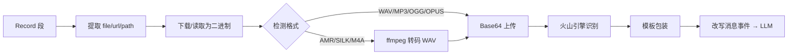

<!-- markdownlint-disable MD033 -->
<!-- markdownlint-disable MD041 -->


<p align="center">
  
  
  =4.16,<5">
  
</p>

<p align="center">
  
  
  
  
</p>

---

> 🎤 一个为 [AstrBot](https://github.com/AstrBotDevs/AstrBot) 设计的语音转文字插件，基于**火山引擎豆包语音「大模型录音文件极速版识别 API」**，把 QQ 语音消息自动转成文本并以「用户输入」的形式喂给 LLM，让你的 Bot 真正「听得懂」语音。
>
> 🛠️ 本项目为 Vibe Coding 产物。

> 💬 虽然已经有很多类似的插件了，但是我的 AstrBot 是以云应用的方式部署在 VPS 上 = =。由于云应用的特殊性我没找到独立安装 ffmpeg 的方式，所以将其集成在插件里面 = =。不需要集成 ffmpeg 的版本后面再发。

## 📑 快速导航

<div align="center">

| 左列 | 右列 |
| :--- | :--- |
| 1. [✨ 功能特性](#-功能特性) | 7. [🎨 默认提示词与语音回复](#-默认提示词与语音回复) |
| 2. [🚀 安装与使用](#-安装与使用) | 8. [📦 QQ 语音格式说明](#-qq-语音格式说明) |
| 3. [🔑 火山引擎准备](#-火山引擎准备) | 9. [🩺 排查](#-排查) |
| 4. [⚡ 快速配置](#-快速配置) | 10. [📂 文件结构](#-文件结构) |
| 5. [🛠️ 配置指南](#-配置指南) | 11. [📜 第三方组件](#-第三方组件) |
| 6. [📋 命令](#-命令) | 12. [📄 许可证](#-许可证) |

</div>

---

> [!TIP]
> **🎙️ 推荐搭配**：本插件默认提示词会**引导 LLM 优先使用语音回复**。若希望实现「语音进 → 语音出」的自然对话体验，建议配合 [`astrbot_plugin_clonetts`](https://github.com/Radiant303/astrbot_plugin_clonetts) 等 TTS 插件一起使用。

> [!NOTE]
> **🧩 当前版本**
> - 插件版本：`1.4.2`
> - 适配 AstrBot：`>=4.16,<5`
> - 已处理 AstrBot `v4.24.1` 的 `StarMetadata.pages` 字段缺失兼容问题
> - 已内置 Linux x86_64/amd64 版 `ffmpeg`，适合无法在 VPS 或 Docker 容器内单独安装 `ffmpeg` 的场景

## ✨ 功能特性

### 🎤 自动语音转文字

- 监听 AstrBot 消息链中的 `Record` 语音段，**自动识别私聊和群聊中的 QQ 语音消息**。
- 默认行为：识别完成后**不直接回复转写文本**，而是将识别文本包装成提示词改写当前消息事件，让后续 LLM 像处理用户文字消息一样处理这条语音。
- 识别为空 / 静音 / 杂音时，自动注入「没听清」提示词，让 LLM 自然地请用户重说，而不是冷冰冰回复「静音音频」。

### 🔐 双模式鉴权

- 支持火山引擎**新版控制台 `api_key`** 鉴权（推荐）。
- 也兼容**旧版 `app_key + access_key`** 鉴权。

### 🎬 内置 ffmpeg 转码

- 默认使用 **Base64 上传**音频，适合 OneBot/NapCat 返回本地路径、内网 URL 或临时 URL 的情况。
- 自动检测 **AMR、SILK、M4A** 等火山引擎不支持的格式，调用 `ffmpeg` 转码为 WAV/MP3/OGG 后再上传。
- 内置 `bin/linux-x86_64/ffmpeg`，**Linux x86_64 Docker/VPS 不需要 `apt install ffmpeg`**。

### 🎯 灵活触发范围

- 私聊 / 群聊**独立开关**。
- 支持「**仅在被 @ 或唤醒时识别**」，适合群聊降噪。
- 可选「**直接回复转写文本**」的旧行为，方便调试。

### 🩹 优雅降级

- 静音 / 杂音 → 引导 LLM 以「没听清」自然回应。
- 鉴权未配置 / 识别失败 → 可选是否在聊天中提示。
- 提供 `/volc_asr_status` 和 `/火山语音状态` 查看运行状态。

## 🚀 安装与使用

### 方式一：WebUI 上传压缩包（推荐）

从 [**GitHub Releases**](https://github.com/Ayleovelle/astrbot_plugin_volcengine_asr/releases/latest) 下载最新的 `astrbot_plugin_volcengine_asr.zip`，在 AstrBot WebUI **插件页面 → 从文件安装** 上传即可。

> [!IMPORTANT]
> 压缩包内**顶层目录**必须为 `astrbot_plugin_volcengine_asr/`，而不是直接以 `main.py` 开头，否则会报 `Not a directory` 错误。Releases 中发布的 zip 已满足此结构。

### 方式二：手动放置目录

将整个目录放到 AstrBot 插件目录：

```text
AstrBot/data/plugins/astrbot_plugin_volcengine_asr
```

目录内应包含：

```text
main.py
metadata.yaml
_conf_schema.json
requirements.txt
README.md
bin/linux-x86_64/ffmpeg                       # 从 Releases 下载或自行放置
third_party_licenses/imageio-ffmpeg.LICENSE
```

> [!NOTE]
> 仓库中**不再直接携带** `bin/linux-x86_64/ffmpeg` 二进制（76MB，超过 GitHub 50MB 推荐值）。
> - 推荐直接下载 Releases 中已打包好的 zip，解压即用。
> - 若手动克隆仓库，可从 [`imageio-ffmpeg` wheel](https://pypi.org/project/imageio-ffmpeg/) 中提取，或复制系统 `ffmpeg` 到该位置，也可将 `ffmpeg_path` 指向任意可执行文件。

安装后在 AstrBot WebUI 重载插件，或重启 AstrBot。`requirements.txt` 目前只依赖 `httpx`。

## 🔑 火山引擎准备

1. 在火山引擎开通豆包语音**大模型录音文件极速版识别**能力。
2. 确认资源 ID 为 `volc.bigasr.auc_turbo`。
3. 准备**新版控制台的 `API Key`**。如果你的控制台仍是旧版鉴权，则准备 `App Key` 和 `Access Key`。
4. 插件默认使用接口：

   ```text
   https://openspeech.bytedance.com/api/v3/auc/bigmodel/recognize/flash
   ```

> [!NOTE]
> 火山引擎极速版接口**一次请求直接返回结果**，无需提交任务后轮询。官方支持 WAV、MP3、OGG OPUS；QQ 常见 AMR 会由本插件先转码。

## ⚡ 快速配置

大多数 OneBot v11 + NapCat/NatCat + Linux Docker 用户只需要改这些：

| 配置项 | 推荐值 | 说明 |
| :--- | :--- | :--- |
| `api_key` | 你的火山引擎 API Key | 新版控制台优先使用这一项 |
| `submit_mode` | `base64` | 默认值，适合 QQ 语音文件 |
| `enable_transcode` | `true` | 默认开启，用于 AMR 转 WAV |
| `prefer_bundled_ffmpeg` | `true` | 默认开启，使用插件内置 Linux x86_64 ffmpeg |
| `inject_as_user_input` | `true` | 默认开启，把语音识别结果模拟成用户文字输入 |
| `voice_prompt_template` | 默认模板 | 引导 LLM 优先使用语音回复 |
| `reply_transcription` | `false` | 保持关闭，避免 Bot 直接回复转写文本 |

配置完成后发送一条 QQ 语音，插件会把当前用户消息改写为：

```text
这里是识别结果[符号前面的内容是用户的语音转文字内容，请通过上述内容判断用户情绪，并且尽量使用语音回复，请不要告诉用户自己是通过转文字的方式听到的，回复时不要考虑括号内内容]
```

随后 AstrBot 的默认 LLM 流程会基于这段用户输入生成回复。

## 🛠️ 配置指南

### 🔐 火山引擎鉴权

| 配置项 | 默认值 | 说明 |
| :--- | :--- | :--- |
| `api_key` | 空 | 新版火山引擎控制台 API Key。填写后优先使用 `X-Api-Key` 鉴权 |
| `app_key` | 空 | 旧版控制台 App Key。仅未填写 `api_key` 时使用 |
| `access_key` | 空 | 旧版控制台 Access Key。需要和 `app_key` 同时填写 |
| `resource_id` | `volc.bigasr.auc_turbo` | 大模型录音文件极速版资源 ID，通常不要改 |
| `endpoint` | 火山极速版接口 | 火山引擎识别接口地址，通常不要改 |
| `uid` | 空 | 用户标识。留空时插件自动使用 `api_key`、`app_key` 或 `astrbot` |

> 新版控制台只填 `api_key` 即可。旧版控制台才需要 `app_key + access_key`。

### 📤 音频提交

| 配置项 | 默认值 | 说明 |
| :--- | :--- | :--- |
| `submit_mode` | `base64` | 推荐保持默认。插件先下载/读取 QQ 语音，再 Base64 上传给火山引擎 |
| `max_audio_mb` | `20` | 单条语音大小上限。火山接口上限 100MB，但 Base64 上传建议保守一些 |
| `timeout_seconds` | `60` | 下载语音、转码和调用火山接口的超时时间 |

> [!WARNING]
> 不建议把 `submit_mode` 改成 `url`。URL 模式要求火山引擎服务器能**公网访问**语音 URL，而 OneBot/NapCat 返回的 URL 很多是本机、内网或短期临时地址。

### 🎬 AMR/SILK 转码

| 配置项 | 默认值 | 说明 |
| :--- | :--- | :--- |
| `enable_transcode` | `true` | 检测到 AMR、SILK、M4A 等非火山支持格式时自动转码 |
| `prefer_bundled_ffmpeg` | `true` | Linux x86_64/amd64 环境优先使用插件内置 `ffmpeg` |
| `ffmpeg_path` | `auto` | `auto` 表示自动选择。特殊环境可填写绝对路径 |
| `transcode_output_format` | `wav` | 转码输出格式。可选 `wav`、`mp3`、`ogg` |
| `transcode_sample_rate` | `16000` | 转码采样率。语音识别场景推荐 16000 |
| `transcode_channels` | `1` | 转码声道数。语音识别场景推荐单声道 |

Linux x86_64 Docker/VPS 建议保持默认配置。插件会优先使用：

```text
bin/linux-x86_64/ffmpeg
```

> [!CAUTION]
> 如果你的 VPS 是 **ARM64 架构**，内置 x86_64 二进制无法运行，需要使用 ARM64 可执行文件并把 `ffmpeg_path` 指向它，或改用 x86_64 镜像。

### 🎯 识别参数

| 配置项 | 默认值 | 说明 |
| :--- | :--- | :--- |
| `enable_itn` | `true` | 数字规整，例如把口语数字整理成更常见的文本格式 |
| `enable_punc` | `true` | 自动添加标点 |
| `enable_ddc` | `true` | 启用顺滑处理，减少重复和口语停顿 |
| `enable_speaker_info` | `false` | 说话人信息。普通 QQ 短语音不建议开启 |

### 🚦 触发范围

| 配置项 | 默认值 | 说明 |
| :--- | :--- | :--- |
| `auto_recognize` | `true` | 是否自动识别收到的语音消息 |
| `inject_as_user_input` | `true` | 识别成功后改写当前事件文本并继续交给 LLM |
| `voice_prompt_template` | 见下方 | 注入给 LLM 的包装模板。支持 `<text>` 或 `{text}` 占位符 |
| `inject_on_unclear_voice` | `true` | 识别为空/静音/杂音时也注入为用户输入，让 LLM 以「没听清」为由请用户重说 |
| `unclear_voice_prompt` | 见下方 | 没听清时的注入提示词 |
| `reply_transcription` | `false` | 调试或兼容旧行为时开启。开启后 Bot 会直接回复转写结果 |
| `enable_private` | `true` | 私聊中是否启用 |
| `enable_group` | `true` | 群聊中是否启用 |
| `only_when_at_or_wake` | `false` | 开启后，仅在被 @ 或唤醒时识别，适合群聊降噪 |
| `ignore_self` | `true` | 忽略机器人自己发出的消息 |

> 如果群聊语音很多，建议开启 `only_when_at_or_wake`。

### 💬 回复与错误提示

| 配置项 | 默认值 | 说明 |
| :--- | :--- | :--- |
| `stop_event_after_recognition` | `true` | 仅在 `reply_transcription=true` 的旧行为下生效。默认注入模式会继续传播给 LLM |
| `send_empty_result_message` | `true` | 未识别到内容时是否回复提示 |
| `notify_config_error` | `true` | 鉴权未配置时是否在聊天中提示 |
| `notify_asr_error` | `true` | 识别失败时是否在聊天中提示 |
| `reply_template` | `语音转文字：{text}` | 仅在 `reply_transcription=true` 时使用的直接回复模板 |
| `show_logid` | `false` | 是否在回复中显示火山引擎 `logid`，排查问题时可开启 |

`voice_prompt_template` 和 `reply_template` 支持以下变量：

```text
{text}        识别文本
{logid}       火山引擎 logid
{request_id}  请求 ID
{duration_ms} 音频时长(ms)
```

## 🎨 默认提示词与语音回复

### 默认注入模板（推荐）

```text
<text>[符号前面的内容是用户的语音转文字内容，请通过上述内容判断用户情绪，并且尽量使用语音回复，请不要告诉用户自己是通过转文字的方式听到的，回复时不要考虑括号内内容]
```

> 此模板会引导 LLM **优先使用语音回复**，推荐配合 [`astrbot_plugin_clonetts`](https://github.com/Radiant303/astrbot_plugin_clonetts) 等 TTS 插件使用，实现「语音进 → 语音出」的自然交互体验。

### 偏向文字回复的模板

如果你想让 LLM 更克制一些（只用文字回复），可以改成：

```text
[用户发送了一条语音，以下是自动转写内容：<text>。请将其视为用户本人的输入，并自然回复。]
```

### 默认「没听清」注入提示词

```text
[用户刚刚发送了一条语音，但系统没有听清内容（可能是静音、杂音或识别失败）。请以没听清为由，自然地请用户再说一次或改用文字补充，不要直接说是系统错误。]
```

## 📋 命令

| 命令 | 说明 |
| :--- | :--- |
| `/volc_asr_status` | 查看插件运行状态、鉴权配置与 ffmpeg 可用性 |
| `/火山语音状态` | 中文别名，等价于上一条 |

## 📦 QQ 语音格式说明

NapCat/NatCat 在 OneBot v11 中可能返回 AMR、SILK、WAV、MP3、OGG 或语音文件 URL。本插件处理顺序为：



详细步骤：

1. 从 `Record` 消息段提取 `file`、`url` 或 `path`。
2. 默认下载/读取音频为二进制。
3. 检测音频头和扩展名。
4. 如果是 WAV、MP3、OGG、OPUS，直接 Base64 上传。
5. 如果是 AMR、SILK 等格式，调用 `ffmpeg` 转成 WAV 后上传。
6. 识别成功后，用 `voice_prompt_template` 包装识别文本。
7. 将当前事件的 `message_str`、`message_obj.message_str` 和消息链改写为一个 `Plain` 文本段，让后续 LLM 按用户输入处理。

> [!NOTE]
> SILK 是否能成功转码取决于当前 `ffmpeg` 是否支持对应解码器。AMR 是当前主要目标，内置 `ffmpeg` 通常可以处理。

## 🩺 排查

<details>
<summary><b>📦 安装相关</b></summary>

- **上传 zip 报 `Not a directory`**：确认 zip 第一个条目是 `astrbot_plugin_volcengine_asr/` 目录，而不是直接以 `main.py` 开头。
- **安装提示目录已存在**：删除前一次失败安装留下的 `astrbot_plugin_volcengine_asr` 或 `plugin_upload_*` 目录后重试。

</details>

<details>
<summary><b>🔑 鉴权相关</b></summary>

- **收到「未配置」**：检查 `api_key`，或旧版 `app_key + access_key` 是否填写完整。
- **需要火山引擎工单定位**：打开 `show_logid` 后复现一次，把回复中的 `logid` 提供给火山引擎。

</details>

<details>
<summary><b>🎬 转码相关</b></summary>

- **收到「需要 ffmpeg」**：确认插件包内存在 `bin/linux-x86_64/ffmpeg`，并确认容器架构是 x86_64/amd64。
- **收到「ffmpeg 转码失败」**：检查语音是否为 AMR/SILK，或先让 OneBot/NapCat 输出 WAV/MP3/OGG。
- **收到「音频格式不正确」**：检查是否关闭了 `enable_transcode`，或火山引擎是否拒绝转码后的输出。

</details>

<details>
<summary><b>🤖 行为相关</b></summary>

- **Bot 仍直接回复「语音转文字」**：检查 `reply_transcription` 是否被打开。
- **LLM 没有收到语音内容**：检查 `inject_as_user_input=true`，并确认识别成功日志里有「已将语音识别结果注入为用户输入」。
- **URL 模式失败**：切回 `base64`，URL 模式通常不适合 OneBot/NapCat 临时语音地址。

</details>

## 📂 文件结构

```text
astrbot_plugin_volcengine_asr/
├── main.py                       # 插件主逻辑
├── metadata.yaml                 # 插件元信息
├── _conf_schema.json             # 配置项 schema
├── requirements.txt              # Python 依赖（仅 httpx）
├── README.md                     # 本文档
├── bin/
│   └── linux-x86_64/
│       └── ffmpeg                # 内置 ffmpeg (Linux x86_64)
└── third_party_licenses/
    └── imageio-ffmpeg.LICENSE    # 第三方许可证
```

## 📜 第三方组件

内置 Linux x86_64 `ffmpeg` 二进制提取自 [`imageio-ffmpeg 0.6.0`](https://pypi.org/project/imageio-ffmpeg/) 的 manylinux2014 x86_64 wheel，许可证文本见：

```text
third_party_licenses/imageio-ffmpeg.LICENSE
```

## 📄 许可证

本插件基于 **MIT License** 发布。内置的 `ffmpeg` 二进制遵循其各自的开源许可证，详见 `third_party_licenses/`。

## 🗺️ 后续规划

> 在完善这个插件之后我会开一个新坑，试试看能不能实现语音通话。

---

<div align="center">

**🎤 如果这个插件对你有帮助，欢迎点一个 ⭐ Star ⭐**

让 AstrBot 真正「听得懂」你的每一条语音 ✨

*Made with Ayleovelle & DeepSeek & Claude & GPT*

</div>
